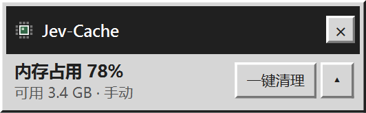
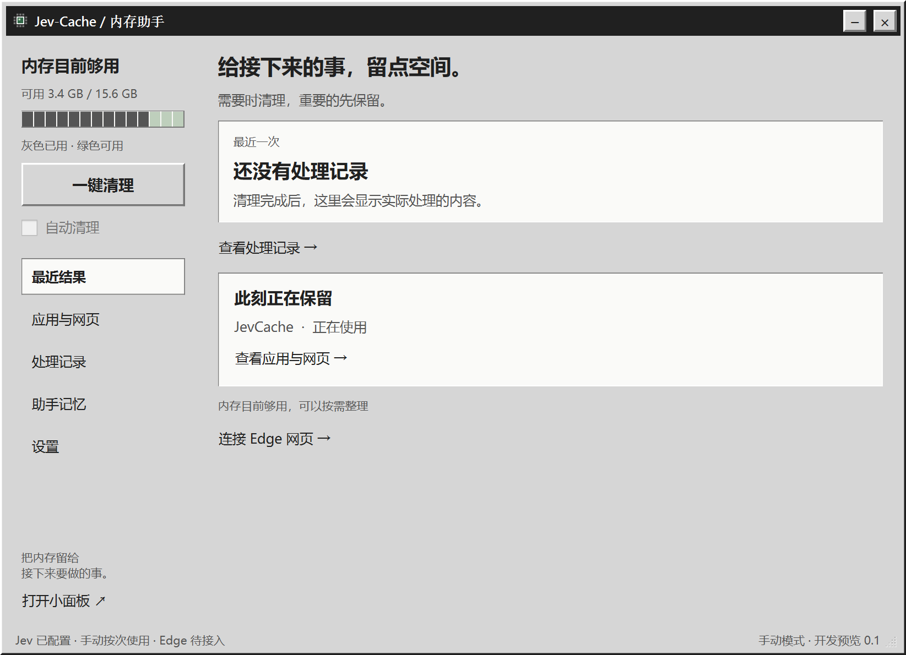
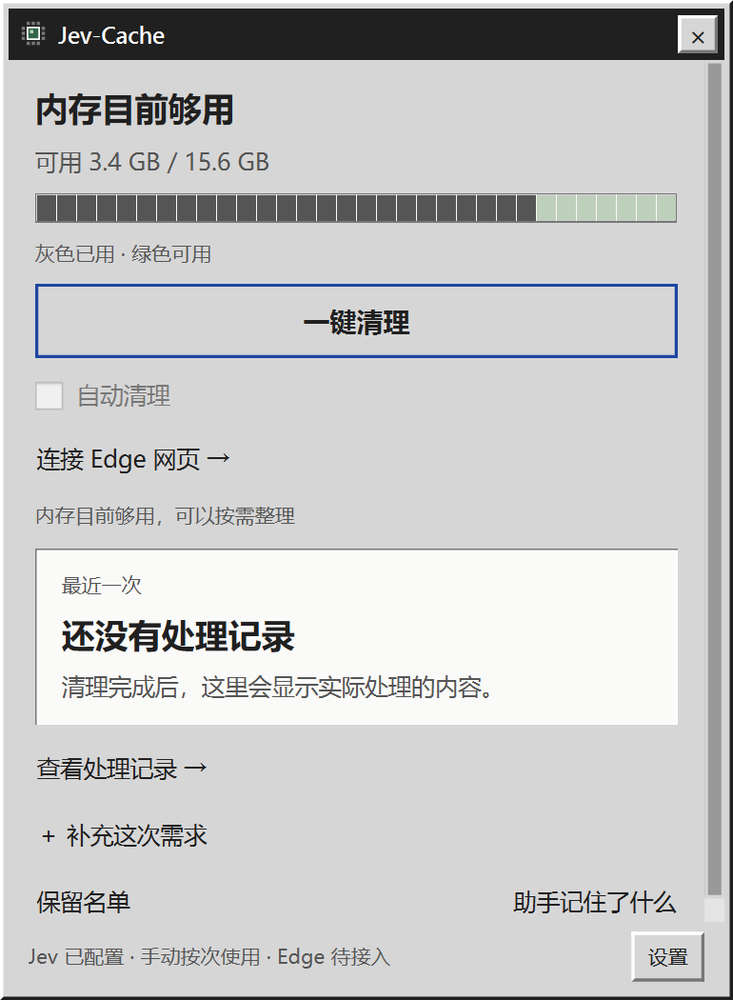

# Jev-Cache

**给接下来的事，留点空间。**

一个由 Jev 辅助判断的 Windows 悬浮窗内存助手。看清后台还占着什么，结合你正在做的事和使用记录，整理当前可以释放的内容，把重要的先留下。

写代码、查资料、准备开始游戏时，你不必先学会看懂任务管理器。Jev-Cache 希望把「哪些可以清理」这件事，变成桌面上的一个按钮。

[▶ 三分钟交互 Demo](https://jev-cache-demo.ag2sag2sliu.chatgpt.site) · [离线 Demo](docs/demo/) · [开始使用](#开始使用) · [当前支持范围](#当前支持范围) · [产品 PRD](docs/PRD.md)

<p align="center">
  
</p>

> 当前为 **0.1 开发预览**：桌面程序已可运行，智能整理先从限定的 Edge 只读文档开始。通用后台进程自动清理仍在后续计划中。

## 它帮你做什么

电脑用久了，你可能已经忘记打开过哪些应用和网页。占着内存的内容里，有些暂时用不上，有些很快还会回来用；单凭占用大小，很难做出合适的决定。

- **一眼看懂现在的内存状态。** 小悬浮窗显示占用比例、可用内存和当前模式，需要时再展开查看应用与网页。
- **少做一次逐项判断。** 配置 Jev 后，点击「一键清理」即可开始判断与整理；有需要时补充一句「我正在做什么」。
- **让保留偏好参与下一次决定。** 可以把重要内容设为保留，也可以纠正处理结果；开启助手记忆后，相关反馈会进入后续判断上下文。
- **知道这次实际做了什么。** 处理记录展示动作结果和随后观测到的内存变化；没有合适对象时，会告诉你当前无需整理。

## 实机界面

界面采用受 TypeSafe 启发的 Windows 98 风格：灰色面板、立体按钮、简单直接的操作。

**主面板：查看当前状态、应用与网页、处理记录和助手记忆。**

<p align="center">
  
</p>

**小面板：展开悬浮窗，就能查看最近结果、补充本次需求或进入设置。**

<p align="center">
  
</p>

以上图片采集自真实运行的 Windows 桌面程序，内存读数为拍摄当时的系统状态；本次截图未执行清理。[截图说明](docs/screenshots/README.md)

## 三分钟看懂使用场景

[打开在线交互 Demo →](https://jev-cache-demo.ag2sag2sliu.chatgpt.site)

从「查资料、写代码后留下许多后台内容」开始，演示状态采集、Jev 判断、执行回执和个人反馈如何连起来。可以自动播放、逐幕切换、查看讲稿，也可以进入自由演示，切换任务和内存压力。

**Demo 中的状态、判断与收益数字均为脚本模拟**，用于介绍产品思路；网页不会连接 Jev、读取电脑状态或执行清理。它也展示了仍在验证中的预期体验，实际能力以本文下方的支持范围为准。在线版已公开访问；也可下载仓库后双击 [docs/demo/index.html](docs/demo/index.html)，直接离线播放。

## Jev 如何参与判断

Jev-Cache 把本地状态整理成一组有限的问题，让 Jev 参与「现在是否还需要保留」的判断：

1. **本地观察。** 收集内存、应用与网页状态，结合近期使用和明确保留设置，选出符合支持范围的候选。
2. **补上个人上下文。** 加入你主动填写的当前任务，以及开启记忆后与候选相关的使用反馈。
3. **交给 Jev 分类。** 每轮最多提交 8 个候选，分别判断与当前任务的关系、未来五分钟的保留价值，以及本轮允许的动作。
4. **本地复核并执行。** 检查答案格式、对象身份与最新状态；当前每轮最多处理一个对象。无法判断、请求失败或状态变化时保留候选。
5. **记录结果。** 保存动作回执，观察内存变化，并把明确纠正与可归因的重新打开反馈用于后续判断。

这条链路已接入 TypeSafe 官方 SDK。真实 API 连接和合成候选请求已通过验证；Jev 相比固定规则的判断增益、个人记忆的效果仍需实测。

## 两种使用方式

| 模式 | 你做什么 | 助手做什么 |
| --- | --- | --- |
| 手动 | 点击悬浮窗或主面板的「一键清理」 | 本次点击授权发送必要状态摘要；直接开始判断并整理符合条件的对象，不跳转设置或打开主面板 |
| 自动 | 在设置中允许自动发送必要摘要，再开启「自动清理」 | 持续观察内存压力；满足触发条件且存在合格对象时，调用 Jev 判断并执行支持的动作 |

自动模式默认关闭。没有配置密钥时，按钮显示「连接 Jev」；仍可查看占用、设置保留，并单独选择符合条件的应用请求正常关闭。暂停、保留名单和助手记忆开关均可由你控制。

## 当前支持范围

| 能力 | 当前开发版 |
| --- | --- |
| 内存状态、应用分组与占用 | 已实现，使用真实系统采集；应用工作集之和可能包含共享内存，不等于可释放量 |
| 悬浮窗、托盘、手动／自动入口 | 已实现；配置后「一键清理」直接启动流程 |
| Jev 选择对象并整理 | 目前仅支持符合条件的 Edge 只读文档；真实页面释放／重载闭环仍待完整验收 |
| 网页适配 | 限 `docs.python.org/3/` 和 `doc.qt.io/qtforpython-6/`；页面探针通过后，才进入后续判断 |
| 桌面应用关闭 | 用户单独选择符合条件的应用，发送正常关闭请求；尚不支持由 Jev 自动清理通用进程或进程树 |
| 本地记忆与反馈 | 保留设置、使用记录、明确纠正及相关反馈检索已实现；可以关闭习惯记忆或清除学习与历史 |
| 效果面板 | 展示实际动作回执和固定时间窗口的系统内存观测；尚无经验证的帧率提升或等待时间收益 |

当前、固定、播放媒体、可能编辑、状态未知或明确保留的网页不会进入智能释放流程。网页释放保留标签入口，回来时重新加载。桌面正常关闭使用 `WM_CLOSE`，不会替你确认放弃保存，也不会升级为强制结束。

Edge 原生睡眠标签保持开启。内存变化还会受到系统与其他应用影响，因此普通运行记录不把全部变化归功于助手。下一步验证重点是**真实网页释放／重新加载、误清理与重开反馈、Jev 与规则对照，以及长期净收益**。详细状态见 [功能验收](docs/FUNCTIONAL-ACCEPTANCE.md)。

## 开始使用

开发环境已在 **Windows 11 + Python 3.12** 验证。仓库提供源码与构建脚本；使用 Jev 需要自行配置 TypeSafe API Key。

### 从源码启动

先安装 Git 与 [uv](https://docs.astral.sh/uv/getting-started/installation/)，然后运行：

```powershell
git clone https://github.com/13-pieces-teen/Jev-Cache.git
cd Jev-Cache
uv python install 3.12
uv venv --managed-python --python 3.12 .venv
uv sync --locked
.venv\Scripts\python.exe -m jev_cache
```

建议使用上述独立 Python 环境，避免已有 Anaconda／Qt DLL 影响启动。依赖锁定在 `uv.lock`。

### 连接 Jev

1. 点击「连接 Jev」或打开「设置」，填入 TypeSafe API Key；默认模型为 `jev-latest`。
2. 「测试连接」发送一次固定测试文本，不上传电脑状态，也不执行清理。保存后即可使用「一键清理」。
3. 如需网页整理，先按下节构建桌面包，再完成 [Edge 接入](EDGE-SETUP.md)。当前主要智能清理对象是已适配的只读文档。
4. 自动清理需要另行允许摘要上传并开启自动模式；手动点击的一次授权不会替你开启自动上传。

API 调用使用你自己的凭据。开发预览采用本地密钥直连；面向普通用户分发的服务网关和凭据管理仍在计划中。

### 构建可双击运行的桌面程序

安装 Node.js／npm 后，先构建 Edge 扩展，再运行打包脚本：

```powershell
cd extensions/edge
npm ci --registry=https://registry.npmjs.org
npm run build
cd ../..
powershell -ExecutionPolicy Bypass -File scripts/build.ps1
```

输出位于 `dist/JevCache/JevCache.exe`。请完整保留整个 `JevCache` 文件夹，运行打包版无需另装 Python。关闭面板会收起到悬浮窗／托盘；托盘菜单中的「退出助手」结束程序。

## 数据与个人记忆

API Key 使用 Windows DPAPI 当前用户加密，保存在本地 SQLite。使用记录和偏好也默认保存在本机；只有经授权、与本轮判断相关的必要摘要和记忆才交给 Jev。

默认不上传完整 URL、文件路径、原始窗口标题、网页正文或命令行。简短网页标题需要单独开启；「当前在做什么」是你主动提供的上下文。关闭习惯记忆后不再读写使用历史，明确保留设置仍然生效。

本地数据目录为 `%LOCALAPPDATA%/JevCache/`，可用 `JEVCACHE_DATA_DIR` 指定独立目录。原始内存窗口仅在 RAM 中保留 10 分钟，日志与摘要定期裁剪。

## 开发与验证

桌面端采用 **Python + PySide6 / Qt Widgets**，通过 `psutil` 与 Win32 采集和执行；**SQLite** 保存本地记录，**TypeSafe SDK** 接入 Jev，**Edge MV3 + Native Messaging** 提供网页状态与释放能力。

最近一次代码验收通过 **46 项 Python 检查、11 项扩展模拟检查和 9 项 Qt 界面检查**。打包启动、原生桥接、真实 Edge 状态同步及真实 Jev 测试请求已有记录；这些结果与尚未完成的真实清理验收分别列在 [验证记录](VALIDATION.md) 中。

```powershell
New-Item -ItemType Directory -Path .local -Force | Out-Null
.venv\Scripts\python.exe -m pytest -q --basetemp=.local/test-tmp
.venv\Scripts\ruff.exe check src tests scripts
```

| 文档 | 内容 |
| --- | --- |
| [产品 PRD](docs/PRD.md) | 用户场景、产品方向与验收目标 |
| [MVP 技术方案](docs/MVP-TECH-PLAN.md) | 采集、决策、执行与记忆设计 |
| [UI/UX 设计](docs/UIUX-DESIGN.md) · [界面实现](docs/UI-IMPLEMENTATION.md) | 交互约定与复古桌面视觉 |
| [Edge 接入](EDGE-SETUP.md) | 安装扩展、连接和故障排查 |
| [功能验收](docs/FUNCTIONAL-ACCEPTANCE.md) · [验证记录](VALIDATION.md) | 已验证的链路、证据与待完成项 |
