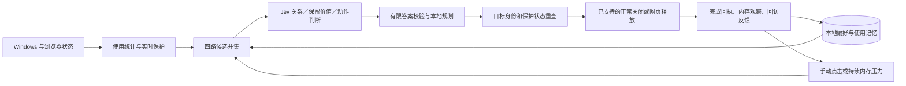

# Jev-Cache · Python MVP 实施方案

日期：2026-09-27。技术基线 v0.3，产品依据 [PRD v0.6](PRD.md)。根据用户选型，已使用 Python + PySide6 实现 0.1 开发预览。此前 WPF 方案归档为选型记录。

## 1. 本轮交付

一个可直接打开的 Windows 应用，包括悬浮窗、托盘和详情面板。程序读取真实电脑状态，提供手动／自动模式、保留对象、可关闭的习惯记忆，以及 Jev 设置与连接测试。无需 Python 的运行目录在 `../dist/JevCache/`，源码和验证入口见 [README](../README.md)。

用户将在 MVP 完成后自行配置 API Key。因此本轮完成真实 SDK 接入和配置路径，以模拟传输验证请求协议；不声称已验证 Jev 的实际判断效果。未配置时明确显示基础模式。

内存和 CPU 是观察项，不作为这一版的固定数字门槛。先保证交互流畅、判断和执行链路可验证，再根据长期运行暴露的问题优化。短时资源记录仅说明特定条件下的开销。

## 2. 已采用的技术

| 层次 | 实现 | 用途 |
| --- | --- | --- |
| Python 运行时 | CPython 3.12 独立环境，uv 锁定依赖 | 避免与本机 Anaconda 的 Qt DLL 相互影响 |
| 桌面界面 | PySide6 Essentials／Qt Widgets | 原生悬浮窗、拖动、托盘、设置和详情；无需 WebView |
| 系统接入 | ctypes Win32 + psutil + pywin32 | 系统内存、应用窗口归组、实例身份、正常关闭与 DPAPI |
| 协调器 | QThread 内单一状态维护者 + 有界命令队列 | SQLite 和策略状态只由一个线程修改；UI 通过信号更新 |
| 模型请求 | 官方 typesafe-sdk 0.7.2，独立网络 worker | 异步有限选项判断；不阻塞界面和环境更新 |
| 策略 | 独立纯 Python core.py | 使用统计、四路候选、保护检查、批次规划和 Ghost 观察 |
| 本地存储 | SQLite／WAL，DPAPI 加密密钥 | 偏好、使用摘要、动作记录；提供清除入口 |
| 浏览器 | Edge MV3／TypeScript，esbuild | 标签页状态和原生 discard；不终止浏览器进程 |
| 本地通信 | Native Messaging + 带认证的 Windows Named Pipe | 桥接器只转发消息，不具有独立清理决策权 |
| 分发 | PyInstaller onedir | 主程序为无控制台 GUI；桥接器保留原生消息标准输入输出 |
| 验证 | pytest、受控窗口、Node 扩展协议测试 | 将策略、真实正常关闭和浏览器模拟验证分开记录 |

具体版本以 [uv.lock](../uv.lock) 与扩展 package-lock.json 为准。

## 3. 执行路径

模型不生成命令、不直接指定 PID，也没有任意执行权。每批最多 8 个候选，每项 3 个主要问题；当前每轮最多执行 1 个对象。手动与自动共用一条执行管线；暂停、保留和设置变更使未执行计划失效。模型等待期间继续采集；返回后重新核对实例与页面导航状态。

默认每 2 秒读取系统内存、每 8 秒刷新应用清单；映像和所有者信息缓存。对于访问受限的进程快速跳过，避免昂贵回退。详情页仅在当前可见页渲染变化。

## 4. 当前可以实际执行的动作

| 对象 | 当前能力 | 已知边界 |
| --- | --- | --- |
| 桌面应用 | 用户单独选择后，向符合条件的单窗口应用发送 WM_CLOSE | 不自动退出第三方应用；保存提示和托盘隐藏不会被计为退出；不强制终止 |
| Edge 网页 | Jev 判断后或用户明确选择，释放合格的只读文档标签页 | 适配限 Python／Qt 文档；保护活动、固定、媒体、输入、加载和状态不明页面 |
| 残留后台组件 | 显示可读取的实际占用 | 尚无经过真实应用验证的自动退出适配器 |

Edge 扩展和桥接程序已包含在运行目录。设置页可注册当前用户 Native Messaging 配置并复制扩展路径；用户需在 Edge 加载该扩展。实际浏览器验证与模拟协议验证分别记录，不能互相替代。

自动模式默认关闭。启用 Jev 和状态摘要上传后，持续内存压力可触发判断；没有合格对象时保留。未配置、断网或返回异常时，不产生新的自动清理许可。

## 5. 记忆与效果展示

本地记录使用时间、衰减频率、明确保留、用户纠正和清理后的观察。相关摘要进入下一轮模型上下文；明确偏好先由本地执行。关闭习惯记忆后不再读取或写入习惯历史，用户仍可保留对象；清除学习时同时移除可重新派生习惯的历史记录。

内存效果使用动作前 10 秒、完成后 5–20 秒的系统可用内存窗口。缺失、并发变化和过大波动使本次比较无效；负值保留。应用工作集之和不显示成“可释放量”，自然变化不归因于模型贡献。

## 6. Jev 配置与后续验证

设置页提供 API Key、模型名称、允许发送最小状态摘要、可选简短标题摘要和测试连接。测试连接只发送固定测试文本。密钥用当前 Windows 用户的 DPAPI 加密；本轮没有真实服务调用。

配置后首先验证请求成功、有限答案是否符合真实上下文、是否选择正确对象，以及状态变化能否阻止旧计划。再评估 Jev 相对规则的增量和记忆的作用，不用“调用成功”代表优化有效。

当前开发阈值未校准；24,000 字节请求上限不等同于严格 token 预算；`jev-latest` 便于开发，正式对照需固定实际模型版本。DeepSeek 待明确出现可改善的判断缺口后再接入。

## 7. 后续里程碑

1. 由用户配置 Jev 后，完成真实模型和 Edge 的首次完整清理、观察及纠正。
2. 选择两款用户实际安装且退出行为可验证的桌面应用，补齐自动正常退出／残留组件适配。
3. 补齐事件级使用归因、活动分组记忆、跨重启 Ghost、严格 token 和磁盘预算。
4. 进行长期稳定性、模型对照及可感知收益验证；资源指标随实测体验调整。
5. 面向普通用户分发时增加产品网关、受限凭据、签名、安装和更新机制。

当前版本是可运行开发预览，不能据此宣称 PRD 全部 P0 或通用自动进程清理已经完成。
