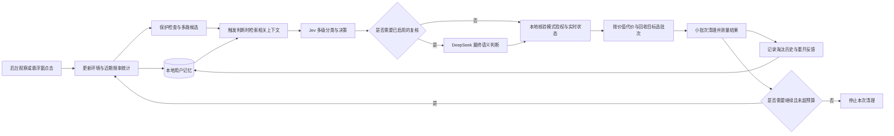

# Jev-Cache · 产品需求文档

版本：v0.6

日期：2026-09-27

项目名：Jev-Cache（暂定）

定位：面向普通 Windows 用户，具有个人记忆、由 Jev 驱动的桌面悬浮窗内存清理助手
状态：产品设计稿；支持范围、性能目标和界面数字均需实测，不能视为已实现效果。

本次修订：项目暂定名 Jev-Cache；将 LRU、衰减 LFU、Jev 上下文判断和淘汰后反馈整合为内存保留／释放策略。明确使用事件、候选生成、批次选择、Ghost History 和对照验收。继续采用悬浮窗、自动／手动、用户记忆，以及按效果启用的 DeepSeek 复核。

> Jev-Cache：会记住你的使用习惯，把内存留给接下来要用的东西。

## 1. 项目共识与产品定义

**Jev-Cache 是一款以电脑悬浮窗形式存在的内存清理助手。它持续获取必要的电脑环境信息，用近期使用和使用频率等信号找出候选，在本地维护用户记忆，再让 Jev 结合当前活动判断哪些内容值得保留、哪些可以释放，执行合格的进程／应用退出、网页释放等动作。**

名称中的 Cache 表达对缓存保留与淘汰思路的借鉴：将应用、网页和已验证组件作为有身份、用途与重开代价的驻留对象管理。实际清理仍使用应用和浏览器支持的接口；操作系统继续负责物理内存分配，应用的运行状态与依赖也必须保留在判断中。该命名不意味着产品已经实现通用缓存系统或内核页面置换。

项目的基本结构为：悬浮窗入口／后台触发 → 环境采集与使用统计 → 本地保护检查及多路候选 → 检索个人记忆 → Jev 多级判断 → 必要时由 DeepSeek 复核 → 按收益和代价分批执行 → 结果测量与淘汰历史反馈。先验证 Jev 单独工作的效果；DeepSeek 根据质量、延迟和成本结果决定是否接入，默认路径不依赖它。

自动模式由程序按环境变化发起判断和清理；手动模式由用户点击悬浮窗发起一次完整优化。两者共享感知和个人上下文。每轮观察、判断及执行结果都可以更新记忆，让后续选择更符合这位用户的使用习惯；这项个人化收益需要实测。

用户的问题是：不知道哪些东西还开着，也不知道哪些已经用完、可以退出；逐个找、逐个判断太费事。关闭窗口后仍在运行的应用，以及不断积累的网页，是首个需要解决的对象。

产品把“找出来、结合个人上下文判断、执行、确认结果、更新记忆”做成一个闭环。用户只面对熟悉的应用和网页，不需要理解进程、线程、工作集或内存调度。首版通过释放不需要的占用，为系统正在进行的工作腾出空间，物理内存分配仍由操作系统负责。

三个基本事实决定产品形态：

1. 占用内存并不等于浪费。正在工作、近期会再用的内容，留在内存里可能更有价值；清理目标是让有需要的工作获得空间。
2. 释放空间需要具体动作：卸载可重新加载的网页、正常退出不再需要的应用、结束已验证的残留组件。仅改变调度优先级或显示更低的占用不构成内存清理。
3. “能够退出”与“现在值得退出”是两个问题。本地能力和状态证据决定前者，Jev 结合当前活动、使用历史和偏好判断后者。

**核心价值：用更少的用户判断，清理暂时用不上的内容，腾出可用内存，同时减少误关和反复重新加载。**

产品的策略目标为：**在获得所需的持续可用内存空间时，尽量减少清理造成的打扰。** 同等释放量下的重开次数、重载等待及用户纠正是核心比较指标；需要的东西仍能继续使用，与内存变化同样重要。

## 2. 唯一主场景与首批用户

### 2.1 Main scene

用户连续使用电脑数小时，打开过许多网页和桌面应用。现在切换应用开始吃力，或者准备开始一项需要更多内存的工作。用户不知道还有哪些后台占用，也不愿打开任务管理器研究。

用户点击悬浮窗上的“一键清理”，助手读取当前环境和用户记忆，经 Jev 判断后直接处理符合本次授权与状态条件的对象，立即展示执行结果，再补上测得的内存变化。用户可以展开查看处理对象和原因，无需先逐个勾选。开启自动模式后，类似情况由助手按需处理。

游戏、办公和 Coding 都可以发生在这个场景中；首版不要求用户选择三种不同的优化模式，也不承诺固定帧率或耗时提升。

### 2.2 首批验证人群

先招募使用 Windows、经常同时打开大量网页与多个桌面应用、实际遇到内存压力的普通用户。优先覆盖 8 GB／16 GB 设备，这是验证样本选择，不是产品永久限制或市场规模结论。

首批网页能力在 Edge 上验证；桌面应用清理独立可用。招募时须说明浏览器支持范围，不把 Edge 样本中的收益泛化成全部 Windows 用户收益。

### 2.3 一次完整体验示例

以下为产品情境，不是本机实测：用户正在处理一份文档，后台留有一组之前查资料的网页、另一个已用完的桌面应用及其组件。

- 当前文档、相关资料和正在进行的通话继续保留。
- 对支持重新加载且状态通过检查的旧网页，卸载内容并保留标签入口。
- 对可以正常退出的闲置应用，按模式请求退出。
- 对归属和生命周期均已验证的残留组件，按支持的退出方式处理。
- 用实际回执展示处理了什么，用独立测量展示可用内存的变化。

“无窗口”“很久没点击”“父进程消失”都只是线索，不能单独证明某项是残留或没有价值。

以下是需要通过测试验证的三类判断差异，假设相关页面均已通过动作能力及保护检查：

| 对象 | 仅看历史使用的线索 | Jev-Cache 结合上下文的预期处理 |
| --- | --- | --- |
| 正在写作所需的资料页 | 很久没有点击，容易靠近 LRU 淘汰端 | 用户仍在写作且有回访习惯，优先保留 |
| 已明确完成选购的商品页 | 刚才反复访问，频率很高 | 当前活动已结束，可进入释放候选 |
| 刚看完并切走的一次性资讯页 | 使用时间很近，LRU 倾向暂留 | 在有用途结束证据时，可早于仍有用的旧页面处理 |

这些例子说明同一套近期／频率信号可以因活动不同而产生不同选择，不表示模型已能可靠推断所有任务结束。

## 3. 自动与手动两种模式

两种模式共用环境采集、用户记忆、Jev 判断、对象分组、执行能力和结果账本。主要区别是清理的触发方式和授权持续时间；程序负责选择合格对象，用户可以另外查看详情并调整选择。

| 维度 | 手动模式 | 自动模式 |
| --- | --- | --- |
| 入口 | 点击悬浮窗“一键清理” | 用户开启“内存紧张时自动清理” |
| 触发 | 用户随时发起，包括开始工作或游戏前 | 检测到持续内存压力，且存在具备自动资格的候选 |
| 环境与记忆 | 运行期间可低频维护使用摘要；点击后补齐当前状态，只在点击后执行清理 | 后台更新状态和记忆，按事件／压力触发必要的模型判断 |
| Jev 的作用 | 结合实时状态与个人记忆，直接选出本次清理对象和动作 | 使用同一套判断，持续选择当前值得处理的对象 |
| 用户操作 | 常规流程一次点击；可选展开详情、保留对象或追加单独操作 | 日常无需逐项确认；可暂停、查看记录、指定始终保留 |
| 不确定对象 | 跳过并在详情显示“需要你决定”，不阻塞其他清理 | 保留该对象，其他合格对象继续处理 |
| 完成反馈 | 悬浮窗显示结果，可展开本次内存变化与逐项记录 | 悬浮窗静默更新状态及记录；默认不弹出完成提示 |

### 3.1 手动流程

1. 用户点击悬浮窗“一键清理”，即发起在已说明支持范围内的一次清理，不再要求对推荐列表进行第二次确认。
2. 本地补齐当前状态与 LRU／衰减 LFU 信号，从多路候选中检索相关个人上下文，交给 Jev 多级判断；有新交互的对象撤出旧计划。
3. 本地核验后直接按小批次执行合格动作；不确定项先保留，不弹出一连串问题。悬浮窗依次显示“正在判断”“正在清理”。
4. 立即显示已完成、跳过和待处理结果，随后补上有效内存观测；执行结果及后续重开行为写入对应的记忆记录。
5. 用户如想自己决定，可从“查看详情”进入对象列表，先看原因和后果，再单独操作。该列表是可选入口，不是默认流程的必经步骤。

一键清理不包含丢弃未保存内容或强制终止。未知保存状态的对象不进入一键执行范围；用户在详情中明确选择时按第 5.3 节处理。应用要求保存时交给用户的原生提示处理，拒绝、超时或仅隐藏到托盘都不能计为退出成功。已知正在编辑、通话或执行任务的对象引导用户先完成操作。

### 3.2 自动流程

开启前，用一次简短说明明确范围：允许助手处理符合条件的后台网页和已验证应用；保留正在使用及状态不明的工作。自动开启本身构成该范围内的授权，无需每次弹窗。

触发由本地计算的可用内存趋势、提交压力和持续时长等共同决定；换页数据可作为辅助信号，不能单独将缺页等同于内存不足。不使用一个固定占用百分比判定所有设备都需要清理。

后台低频采集必要的电脑状态；出现有效使用、任务切换、新后台对象、用户反馈或应用退出时，更新近期／频率统计、候选及有变化的记忆。在相关状态变化或压力触发时，把新窗口与检索出的个人上下文交给 Jev；不为每个采样点都发请求。自动执行仍须满足压力条件。按第 5.1 节选择影响较小且有回收价值的对象，执行一小批后重新观察。压力缓解、对象不足或收益不值得继续时立即停止。清理后重开进入第 5.5 节的淘汰历史与冷却机制，避免“刚清掉又加载”的循环。

对已明确结束会话的残留组件，先按同样规则纳入候选；首版不另建一个常驻强制扫尾模式。

### 3.3 用户控制

- “始终保留”：按应用或明确网页范围保存，立即生效，优先于模型建议。
- “暂停自动清理”：1 秒内停止发起新动作；已完成的退出或网页卸载不会被假装撤销。
- “重新打开”：只对支持重开操作的记录提供，说明网页需加载、应用状态未必完整保留。
- “这次不该清理”：关联具体动作，调整本地偏好并降低同类重复推荐；不自动扩大为所有场景的永久规则。
- “记住使用习惯”：单独控制个人行为记录与使用。关闭自动清理后，手动模式仍可使用已启用的记忆能力；关闭记忆功能后，不再新增或读取行为习惯，但用户明确设置的保留项仍有效。

### 3.4 悬浮窗形态

默认以小型桌面悬浮窗常驻，可拖动、靠边收起、临时隐藏。主控件为“一键清理”，旁边提供展开入口；展开后显示自动模式开关、最近结果、处理记录和“助手记住了什么”。托盘只作为收起后的辅助入口。

悬浮窗默认显示“目前够用／建议整理／正在判断／正在清理／本次结果”等简单状态。CPU、PID、线程和复杂曲线不放在默认界面。全屏使用时默认收起，后台工作仍按用户模式继续，避免打断游戏或视频。

拖动不触发清理，连续点击合并为同一请求。手动请求与正在运行的自动批次共用一个执行队列，显示已有进度，不重复结束对象。用户暂停或新增保留项立即影响未执行部分。

## 4. 三类对象与首版接入

### 4.1 对象和动作

| 用户看到的对象 | 首版实际动作 | 自动处理条件 | 手动处理边界 |
| --- | --- | --- | --- |
| 浏览器中的一组网页 | 通过浏览器释放接口卸载内容，保留标签 | 已验证页面范围；可重新加载；保护状态证据完整；Jev 判断近期不需要；用户允许 | 对合格页一键处理；其他页明确呈现重新加载影响，不暗中丢弃已知编辑内容 |
| 一个桌面应用 | 请求应用正常退出并核实是否结束 | 具体版本及退出路径已验证，无待完成工作和未保存状态，符合偏好与 Jev 判断 | 用户可主动请求正常关闭；出现保存提示交给用户，不自动升级为强杀 |
| 某应用的后台残留组件 | 用已验证的组件退出机制结束 | 应用会话已结束、组件归属明确、没有其他使用者或未完成职责、退出路径已验证 | 用应用名称解释归属；证据不全时不提供批量清理该组件的入口 |

必须保留：当前活动及其依赖、已知未保存工作、通话／录制／媒体活动、下载上传和同步任务、用户指定保留项、系统与安全组件。关键状态无法取得时，对应自动动作不开放。

身份和分组在本地完成：应用标识、安装来源、进程创建时间、会话和依赖关系组合校验。同名文件不一定属于同一应用；一个父子树不一定能整体结束；一个浏览器渲染进程也不一定对应一个网页。共享组件未知时保留，不直接结束浏览器 GPU／网络／共享渲染进程。

### 4.2 接入范围与发布要求

首版维护 **Windows 本地助手 + Edge 扩展**。桌面退出适配包含在本地助手中，不要求用户安装 IDE 扩展或托管终端任务。

| 接入 | P0 交付范围 | 发布前必须落实 |
| --- | --- | --- |
| Windows 本地助手 | 应用识别分组、低开销内存观测、手动正常退出、已验证对象的自动退出和残留处理 | 至少 2 款真实第三方桌面应用完成正常退出验证，其中至少 1 款完成自动处理及实际残留组件验证；可由同一款覆盖后两者 |
| Edge 扩展 | 标签身份、使用摘要、保护信号、限定页面的释放与激活回执 | 在稳定版验证 API、权限、页面状态与重新加载行为；覆盖只读页面、动态交互页及必须保护的反例 |
| 本地记忆与记录 | 用户偏好、当前会话、行为模式、清理后果、模式设置与重开入口 | 按用户隔离、按有效期更新；跨重启保留适用历史，清除失效会话；支持关闭、纠正和删除 |

具体桌面应用名单是工程验证阶段的必交付物，当前尚未选定或验证。选型依据是首批用户真实安装情况、实际内存收益和可靠退出能力；不能只用为演示编写的测试进程满足发布门槛。若找不到符合要求的对象，必须收缩公开能力说明，不能把浏览器演示称为通用进程清理产品。

每个发布适配记录：应用与适配器版本、支持状态、证据来源及有效期、保护条件、退出与回读方式、重开限制、实测记录和最近验证日期。更新导致状态失效时，仅撤下该动作，其他支持对象照常可用。

### 4.3 浏览器原生功能与能力边界

Edge 已默认提供睡眠标签页及相关保护机制。产品与验证均保留原生功能开启，不把原生休眠收益计为助手成果。仅对接口明确报告的状态标记已处理；无法可靠辨识原生睡眠时标记未知，不假定标签仍完整驻留，也不估算其可释放量。并发原生释放无法分离时，该批次只展示系统观测变化。Jev 的待验证增量是根据当前工作及偏好选择额外值得释放的对象，并把网页与桌面应用放在同一个整理流程中。[Edge 睡眠标签策略](https://learn.microsoft.com/en-us/deployedge/microsoft-edge-policies/sleepingtabsenabled)

Edge 官方支持表包含 `tabs`，但 `processes` 标记为 Dev channel。稳定版的具体能力须实测，首版不承诺逐标签精确内存数字。[Edge 扩展 API 支持表](https://learn.microsoft.com/en-us/microsoft-edge/extensions/developer-guide/api-support)

`tabs.discard` 会卸载网页，再次激活时重新加载。`autoDiscardable` 及 discard 成功都不能替代未保存状态检查；没有声音、没有表单输入事件也不足以覆盖所有网页状态。页面适配必须定义可观测范围，缺失时进入未知。[Tabs API](https://developer.chrome.com/docs/extensions/reference/api/tabs#method-discard)

## 5. Jev-Cache 的保留与淘汰策略

### 5.1 LRU／LFU 生成候选，Jev 判断当前保留价值

LRU 表达“最近多久没用”，LFU 表达“用得是否频繁”；两者都以历史使用推测后续需求。Jev-Cache 把这些信号与当前活动、用户习惯、已结束工作及清理后果结合，判断本轮应保留什么。LRU／LFU 是可独立运行的基础策略，也是模型输入，不能直接等同于退出资格。

| 层次 | 负责人 | 具体工作 | 输出 |
| --- | --- | --- | --- |
| 保护与能力 | 本地程序 | 识别身份、工作状态、依赖、用户保留项及支持的动作 | 可处理范围和保留对象 |
| 基础候选 | 本地程序 | 合并长期未用、低频、大占用、已结束活动四路候选 | 有来源和版本的候选列表 |
| 个人上下文 | 本地记忆模块 | 检索场景频率、回访习惯、近期清理及用户纠正 | 与本轮相关的记忆摘要 |
| 保留价值 | Jev；可选 DeepSeek 复核 | 判断对象用途、近期需求、本轮是否已用完及允许动作 | 保留／可稍后再用／已用完／信息不足等有限结果 |
| 批次选择 | 本地程序 | 按最终语义等级、重开代价和可靠回收信息选择小批次 | 有上限与停止条件的清理计划 |
| 反馈更新 | 本地程序 | 记录实际释放、重开、重载等待及用户纠正 | 淘汰历史、冷却状态和习惯更新 |

四路候选取并集，而不是只把 LRU 队尾送给 Jev，以免遗漏刚使用完却仍高频的对象。默认模型批次最多 8 项：初始按各路最多 2 项去重，剩余位置按预定轮转规则补齐；缺少可靠内存归属时不强行填充“大占用”一路。记录未入批对象及原因，后续批次可继续处理，不能让同一批高占用对象长期挤掉其他来源。完整的保护关系先在本地解析，不随候选截断丢失。

“已结束活动”必须有用户明确选择、适配器生命周期或足够的新鲜状态作为依据。没有窗口、CPU 低、最近没点击均不能单独证明结束。对已经确定无歧义的退出流程，代码可直接处理，无需为制造调用加入模型。

初版批次排序采用可复核的顺序规则：先应用所有硬性保护条件；在可处理对象内优先选择语义上本轮已用完的对象，再考虑可稍后再用的对象；同等级内优先较低重开代价，再比较可靠回收信息，最后用近期／频率信号处理同等候选。未知代价不能当作零，未知回收量不能当作已知的大收益。该顺序是待调优的启发式，不宣称求得全局最优；变更须有版本并重新对照。

需要更多表达能力时，可以分别判断使用价值、场景关系等维度，再由代码组合；首版不要求模型输出精确未来访问概率或任意加权总分。未保存工作、明确保留等硬条件始终独立，不能被大内存收益抵消。[TypeSafe 组合评分模式](https://docs.typesafe.ai/patterns/composite-scoring)

自动模式根据本地压力生成回收目标与上限；手动点击生成本次有界计划，内存充裕时不强求释放固定 GB。每批执行后用真实系统变化校正，不累加共享进程工作集或不可靠的逐页估值。达到目标、压力缓解、计划耗尽、期限到达或继续处理不值得时停止，不为追求数字临时抬高目标。

已有 ARC 会自适应地平衡近期与重复使用，GreedyDual-Size 将对象大小和取回成本纳入策略，学习型 CDN 缓存也已有研究。Jev-Cache 借鉴这些思想，待验证的增量是应用／网页层的个人活动理解与较低打扰，不能把“LRU＋LFU＋AI”本身称为已证实的新算法。[ARC](https://www.usenix.org/conference/fast-03/arc-self-tuning-low-overhead-replacement-cache)、[GreedyDual-Size](https://www.usenix.org/conference/usits-97/cost-aware-www-proxy-caching-algorithms)、[学习型缓存研究](https://www.usenix.org/conference/nsdi20/presentation/song)

Jev 必须真实影响对象和动作选择。其价值通过同等持续内存收益下更少打扰、或同等打扰约束下更多有效释放来验证；单次真实请求成功只证明服务接通。

### 5.2 输入状态

环境采集从本机能取得的底层信息开始：进程身份与创建时间、应用归属和直接关系、内存占用及趋势、前后台切换、进程起止事件，以及接入方实际提供的网页／任务状态。CPU、I/O 等仅作为辅助活动信号，不以“很低”推定工作已完成。缺失字段明确标记未知；本地先归组和汇总，再把必要内容交给模型。

| 输入 | 本地整理的内容 | 约束 |
| --- | --- | --- |
| 当前活动 | 前台应用、最近切换、可验证的任务关联、用户明确表达的用途 | 前台只是一个信号，后台工作仍可能重要 |
| 候选对象 | 已验证的应用／网页组身份、对象角色、直接依赖、当前允许动作 | 使用稳定候选 ID，不让模型从完整进程树猜身份 |
| 使用窗口 | 最近使用时长、回访频率、共同使用关系、已结束会话证据 | 时间、计数、趋势均由本地计算；带上覆盖范围 |
| 近期与频率 | 距离最近有效使用的时间、衰减频率、活动分组统计、候选来源 | 记录事件定义、合并间隔、衰减参数和观测覆盖，缺失不按零频率解释 |
| 工作状态 | 编辑、媒体、通话、传输、组件生命周期及退出能力 | 每项带来源、观测时间和有效期；区分已观察、推断和未知 |
| 偏好 | 始终保留、这次不用、历史纠正及适用范围 | 明确保留直接生效，用户的一次选择不自动扩大授权 |
| 个人记忆 | 与本轮对象相关的会话关联、回访习惯、清理后果及用户反馈 | 每条带来源、样本范围、有效期和版本；不把全部使用历史塞进请求 |
| 成本与压力 | 本地计算的内存压力类别、可测占用、已知重开代价 | 未知的回收量不能由模型编造；数字排序在代码中完成 |

模型请求由 `current_state`、`candidate_objects`、`relevant_memories`、`allowed_actions` 和版本信息组成，记忆与实时事实分别标注。本产品据此组织状态；TypeSafe 接受结构化 state，并对同一 state 的问题独立作答。[TypeSafe State 文档](https://docs.typesafe.ai/concepts/state)

**使用事件口径：** 应用／网页由用户主动激活、回访，或适配器提供明确的使用事件时更新统计；连续前台停留保持活跃，短时间来回切换按预定义间隔合并，避免频率虚高。进程枚举、轮询次数、后台心跳和自动拉起不计为用户使用。通话、下载等持续工作依靠状态保护，即使没有点击也不能据此淘汰。

LRU 顺序由最近有效使用时间生成；LFU 使用随时间衰减的使用事件计数，不采用终身累计次数。衰减、时间比较和计数全部在代码中完成。初始衰减半衰期与事件合并间隔由独立试点确定，正式测试前登记，所有对应基线采用相同口径。

在全局统计之外，为有证据的活动分组维护局部频率，例如“写作期间”的回访记录；分组来源可为用户选择、可靠应用关联或带来源的模型推断。分组不确定时保留未知，并使用有覆盖说明的全局统计；模型猜出的场景不会自动变为事实。同一观测不因多次模型分类而重复计数。

冷启动或关闭习惯记忆时，只使用当前有效窗口与明确设置，不读取持久化 LFU、回访模式和个性化淘汰历史。未观察到某对象被使用，不等于已证实它是低价值对象。

### 5.3 多级分类与动作判断

判断在逻辑上分为“对象与当前工作的关系 → 当前及近期保留价值 → 具体动作”。本地已知的身份和能力先确定；Jev 主要解释用途、个人习惯与当前场景的关系，再选择可执行动作。多级分类是本产品的决策组织方式，可参考 TypeSafe 的层级分类模式；其官方示例效果不等于本产品效果。[层级分类示例](https://docs.typesafe.ai/cookbooks/hierarchical_classification)

每个候选只提出有用的问题，使用有限选项并包含信息不足。Jev 的 Choice 可用于这类结构化判断。[Choice 文档](https://docs.typesafe.ai/primitives/choice)

| 编号 | 问题 | 主要答案 | 如何使用 |
| --- | --- | --- | --- |
| J01 | 对象与当前工作有什么关系？ | 支撑当前工作／独立但仍需继续／有证据表明当前无关／信息不足 | 保护当前依赖和并行必要工作，筛选待处理对象 |
| J02 | 根据使用记录、活动与个人记忆，现在保留它的价值如何？ | 很可能近期再用／有证据表明可稍后再用／有证据表明本轮已用完／信息不足 | 形成保留和清理的优先层级；用途判断不能替代保存状态或退出能力证明 |
| J03 | 根据完整状态，本轮应采用哪种已允许处理方式？ | 保留／释放网页／请求正常退出／仅列为手动候选／信息不足 | 直接影响执行计划；选项按对象能力和模式生成 |

三个问题各自读取完整的必要状态，不能假设看到同请求其他答案。代码按下表合并答案，规则从上到下优先适用。若需要依赖前一答案补取证据，再发新请求。独立问题可以批量请求，以减少往返。[TypeSafe 批量判断模式](https://docs.typesafe.ai/patterns/fan-out)

| 组合结果 | 自动模式 | 手动模式 |
| --- | --- | --- |
| 已知保护条件成立，或身份／动作能力不明 | 不执行 | 不进入批量清理，先解决状态或能力问题 |
| 保存状态不明，但有经过验证的正常关闭或网页释放能力 | 保留 | 默认不选；应用可由用户发起正常关闭并处理原生提示；网页须明确单独选择并知晓临时状态可能丢失，不与推荐项一起默认选中 |
| J01 判断仍需继续、J02 判断近期再用，或 J03 选择保留 | 保留 | 放入已保留区，不推荐清理；用户主动改变用途选择后重新检查 |
| 仅用途不明、模型答案矛盾、未达校准门槛，或 J03 为信息不足／手动候选 | 保留 | 在实际动作能力允许时列入“需要你决定”，默认不选 |
| 事实条件通过，J01／J02 支持清理，J03 选择对应释放或退出动作 | 在压力及授权范围内执行 | 进入本次一键清理计划，直接执行，无需再次确认 |

用户手动选择可以补充当前用途，但不能把未知保存状态改写为“已保存”。网页卸载没有与应用保存提示等价的通用保障，这两类手动操作必须分别处理。

多级不要求每级都产生一次网络往返。已有充分状态时，独立问题可一轮批量判断；若前级答案决定需要检索哪段记忆或补取哪种状态，则由代码取回新证据，再发下一轮。记录每级输入、输出和实际往返次数，不在同一并行请求中假装后级已读取前级答案。

第 5.6 节复核启用时，表中的语义结论采用经复核后采纳的结构化结果，并记录决策来源。DeepSeek 可以修正 Jev 的用途判断，不能修改身份、保存状态和权限等事实条件。

J02 的“可稍后再用”和“本轮已用完”只在其他事实条件通过时支持清理，排序按第 5.1 节执行。每次判断明确近期观察窗口；首版以随后 5 分钟作为回访与维持收益的主要观察窗，并记录更晚的用户纠正，不让模型自行变换“近期”的含义。模型不负责计算应释放多少字节，不生成任意系统命令，不自行新增动作能力。

### 5.4 延迟、未知与个性化

采集一段有效窗口后请求判断；已有充分状态时可立即请求，冷启动则先积累必要信息。界面区分“正在识别”和“正在清理”，完整记录从点击到建议、执行及测量的时间。

初始目标为证据充分、网络正常时 5 秒内给出建议，Jev 请求端到端 P95 不超过 3 秒；均为待验证目标，不用供应商推理速度替代实际产品延迟。稳定状态复用仍有效的判断，事件触发更新，无变化不持续请求。

Choice 的置信度描述答案分布集中程度，不是退出安全概率。每类问题和动作分别校准；高置信度不能补齐未保存状态或工作完成证据。[置信度文档](https://docs.typesafe.ai/confidence)

发布固定模型与问题版本，升级先回放。中文偏好和应用信息单独验证。个人化来自本地保存的偏好与反馈，再作为后续输入提供，不假设模型自动记住每台电脑。[模型说明](https://docs.typesafe.ai/models)

Jev 官方列出了数值运算、时间比较、多层间接关系及无关长上下文等边界，因此数值计算、身份解析和直接关系整理先在本地完成。第三方应用名、网页文本均视为数据，不得改变保护条件或可执行动作。[Jev 能力边界](https://docs.typesafe.ai/model-jaggedness/jev-1.13)

### 5.5 用户记忆状态上下文（P0）

记忆由本地程序维护，按当前 Windows 用户与设备隔离。它是下一轮决策的实际输入，除供用户查看的处理记录外，还维护可检索的个人上下文；首版不需要完整聊天历史、向量数据库或无限行为日志。

| 记忆层 | 记录内容 | 对下一轮的作用 | 生命周期 |
| --- | --- | --- | --- |
| 明确偏好 | 始终保留、这次不用、某类对象先让我决定；关联应用／场景范围 | 约束允许动作；明确选择优先于习惯预测 | 持续偏好保留至用户修改；本次偏好随当前会话结束 |
| 当前会话 | 最近活动、共同使用的应用／网页组、切换和会话结束线索 | 判断后台对象是否仍参与当前工作 | 任务切换时更新；进程／页面身份变化时重验，重启后重新建立 |
| 行为模式 | 在某类活动中常回访哪些对象、回访区间、共同使用关系、支持样本与反例 | 预测近期留用价值，调整清理优先层级 | 滚动汇总并衰减；长期无新证据则停用，不固化为永久规则 |
| 清理后果／Ghost History | 已释放对象的标识、当时场景、动作原因与结果、多久后重开、重载代价及纠正 | 调整相同场景的保留优先级与冷却，减少反复清理 | 与本助手动作回执关联，按期限压缩为带覆盖范围的摘要 |

每条持久记忆最少包含：`memory_id`、对象与场景范围、内容、来源类型、证据引用、首次／最近观测时间、支持样本数、反例、有效期及版本。来源区分用户明确指定、直接观测、统计归纳和模型假设。模型置信度与行为样本可信度分别保存，不混成一个“安全分数”。

应用长期关联使用稳定应用身份；进程实例附创建时间，网页附浏览器会话与导航版本。PID、tab ID 不单独作为跨会话记忆键。网页历史尽量按本地站点类别或分组归纳，不长期保留完整浏览轨迹。

**Ghost History：释放内容，保留必要的淘汰记录。** 这一设计借鉴缓存中的 ghost history：记录近期被淘汰对象的标识及后续访问，用于改进策略。Jev-Cache 的记录还包含个人活动和重开代价；它不保存进程内存或完整网页副本，也不承诺恢复运行现场。[ARC 对 Ghost Caches 的讨论](https://www.usenix.org/legacy/events/fast03/tech/full_papers/megiddo/megiddo.pdf)

每条淘汰记录必须能关联本助手实际执行的动作、候选来源、所用统计与记忆版本。后续 5 分钟记录用户主动重开、后台自动重启、重载完成及用户纠正；无法识别原因时保留未知，观察中断则记录有效覆盖时长。由浏览器原生功能或用户自己关闭的对象另记来源，不冒充助手清理结果。

只有一次匹配成功的真实重开才计一次回访，多个进程或连续采样不重复增加次数。自动拉起触发当前会话停止重复处理，不把它学成用户喜好；用户主动重开进入冷却，并作为场景保留价值的反馈；明确纠正立即生效。“观察期内未再打开”只是带覆盖范围的结果，不能证明退出安全、没有损失或用户满意。

**每轮更新与使用流程：**

1. 观察窗口结束，追加真正变化的事件，更新当前会话与统计摘要。重复采样只更新同一观测的时间与覆盖，不把一次使用累加成许多独立样本。
2. 根据当前活动和候选检索相关偏好、习惯及 Ghost History，合并重复内容、剔除过期记录；与实时环境组成 Jev 的决策上下文。初始记忆输入预算为总输入 8,000 tokens 中的 2,000 tokens，硬性保留规则在本地先应用，不因预算裁剪丢失。
3. Jev 返回分类和动作建议；存在真实记忆歧义时，可另给它“已有记忆是否适用”“新证据支持保留／更新／降权哪条假设”等有限选项。此类判断按需发起，计入同一调用与成本预算，不增加每轮固定必问项。
4. 本地执行后记录回执和实际效果；用户重新打开、明确纠正或改变偏好时，更新对应后果与模式，再供后续决策检索。
5. 每次写入均记录原因和证据。允许合并、纠正、失效和删除，不要求每轮都增加一条长期记忆。

Jev 可以提出记忆更新建议，本地程序校验目标、作用范围、证据和操作类型后落库。新假设只能进入有有效期的待验证状态，不能直接成为自动退出资格。模型重复读到自己的推断，不增加支持样本或升级为事实；没有新行为证据就不刷新其可信度。

**冲突与反馈规则：** 实时已验证保护条件始终优先；明确用户偏好优先于历史模式；当前用途改变时重新解释旧习惯。同一事实采用适用范围内的新鲜直接观测，来源冲突则标记未知。过去多次没重开，仅支持近期回访预测，不能证明没有数据损失，也不能扩大自动处理权限。

长期反馈按活动范围更新：同一对象在写作期间多次被主动重开，会提高该场景的保留优先级，但不会永久禁止其他场景清理。原因未明的重开只作为可能打扰的信号；用户明确表示“不该清理”时立即修正，不要求累计多次投诉。衰减 LFU 与反馈调整的具体参数均由代码维护并记录版本，模型不能私自改动计数或冷却阈值。

上下文选择也借鉴近期与频率信号：先按对象、活动和证据有效性过滤，再在相关记忆内考虑最近使用及复用频度，控制输入预算。检索频繁只代表这条记忆常被使用，不增加其事实可信度；明确偏好和关键保护不参与低频淘汰。电脑驻留对象的释放与模型上下文的筛选分别记账，不能把减少 tokens 算成释放了电脑内存。

冷启动不依赖历史，用当前状态和明确设置照常运行。初版保留策略：原始低频窗口仅在内存环形缓冲中保留最近 10 分钟，事件与行为明细最多 7 天，推断模式在 30 天没有支持证据后停用；这些为初始产品策略，须随开销与实测调整。明确偏好独立保存，模型决策缓存独立设有效期，缓存答案不进入事实层。

用户可从“助手记住了什么”查看常用组合、保留偏好和被纠正的行为，以普通语言修改、删除或清空学习记忆。关闭习惯记忆后，不再写入或读取行为历史；实时执行必需状态和明确保留项继续工作。删除操作同时清除派生摘要与相关缓存、增加记忆版本，并使依赖已删除内容的未执行计划失效，防止旧记录重新生成被删记忆。需要重置保留项时提供独立操作。

**个人化例子（设计示例）：** 用户写文档时经常隔一段时间回看某组资料页，清理后曾很快重新打开。下一次写作期间，Jev 看到这个习惯，会优先保留资料页、处理其他低影响对象。用户明确表示“这些资料用完了”，或新状态足以支持原活动结束时，再调整该组网页的优先级。相同闲置时长下，因个人上下文不同而采取不同选择，是需要验证的核心收益。

### 5.6 可选 DeepSeek 最终语义复核

先交付和评估 Jev 单独判断，不默认每次同时调用两个模型。如果真实样本显示复杂上下文、记忆冲突或某类用途判断持续不足，再启用 DeepSeek 复核实验。先区分输入缺失、状态整理错误、模型错误和执行失败；更换判断模型不能解决不存在的状态证据。

初始复核路由针对已具备动作资格但语义判断不确定、互相矛盾，或验证集上表现不足的场景；必要时可对该类场景全部复核，以覆盖高置信度错误。触发条件在实验前确定，不能只按模型自己报告的低置信度判断质量。

交给 DeepSeek 的信息包包括：精选的实时事实、相关用户记忆及来源、候选与允许动作、Jev 各级结果和分歧、需要复核的具体问题。保留原始证据引用，不能只交一段由 Jev 结论拼出的摘要，以免最终判断受错误摘要限制。

DeepSeek 作最终语义判断，输出候选 ID、修订后的 J01／J02／J03 完整枚举结果、引用的证据／记忆 ID、尚缺信息和约定的失效条件。通过校验后，程序以这组完整结果替换本轮旧语义结果，再运行同一决策表；原始 Jev 结果保留用于审计。缺少必要字段时整组复核无效，不能拼接新动作与旧用途结论。原始事实、明确偏好和动作能力不被覆盖。

程序负责限定有效期、格式及枚举校验、事实门槛、状态重查和执行。结构化 JSON 是接口手段，不能保证结论正确；实现时按所选 DeepSeek API 的输出约定接入。[DeepSeek JSON 输出文档](https://api-docs.deepseek.com/guides/json_mode/)

模型复核可以处理“这些已知信息应怎样理解”，不能补造“已保存”“下载已完成”或将未知进程升级成可终止。复核产生的用户习惯仍记为推断，不能覆盖明确偏好。超时、非法输出或事实仍不足时保留该对象，不退回已被判定需要复核的危险建议；其他独立对象可继续处理。

单独记录复核比例、纠错与误改率、端到端延迟和费用；此路径不套用 Jev 单独路径的 5 秒目标。只有增量质量足以覆盖新增等待和成本，才把复核用于发布版本。模型版本在实施时选定并验收，不在 PRD 假定某一 DeepSeek 型号天然更可靠。级联设计可参考 TypeSafe 的复核模式，但本项目需要独立实验。[级联示例](https://docs.typesafe.ai/cookbooks/sde_cascade)

## 6. 执行闭环与权限



- 每个计划绑定对象身份、创建／导航版本、观测窗口、所用记忆及偏好版本和策略版本。目标重新活动、页面导航、任务开始、关键记忆被更正／删除或用户保留时，取消旧计划。无关统计更新不使全部计划失效。
- 同一对象的重试必须幂等；清理批次有最大对象数、截止时间和停止条件，模型不能覆盖这些限制。
- 请求正常关闭只是请求。`WM_CLOSE` 允许应用自行处理及提示用户，并不保证整个应用退出；关闭到托盘、部分窗口关闭和完整退出要分别回读。[Windows WM_CLOSE](https://learn.microsoft.com/en-us/windows/win32/winmsg/wm-close)
- 不自动确认“放弃保存”，不把退出失败升级成强制结束。不终止权限不允许访问的目标。
- 首版以当前用户权限工作。系统服务、驱动和受保护组件不进入清理范围；不依赖常驻管理员服务完成基本体验。
- 重开是补救能力，不是事务回滚。应用退出及网页卸载后，不能承诺精确恢复所有运行状态；自动动作开放前必须验证其可接受影响。
- 断网或 Jev 超时时，界面显示“基础模式”。只开放本地识别与占用展示、用户主动发起的已支持正常关闭／明确选择的网页释放、仍有效缓存对应的原许可动作，以及已获授权且无歧义的组件退出；每项继续检查原保护条件。新的语义候选留待联网，不新增自动资格或放宽门槛。暂停、保留和重开均不等待云端。
- 收集信息、更新记忆、发起判断和执行清理是分别受控的步骤。手动模式允许已说明的后台观察与记忆维护，但只有用户点击才执行；自动开关关闭时，后台判断结果只用于状态显示或仍有效的缓存，不触发清理。

## 7. 优化面板与内存账本

### 7.1 悬浮窗与展开面板只突出一个主收益

小窗以 Jev-Cache 名称承担即时入口和简短结果，展开面板显示下列详情。“助手记住了什么”位于详情入口，展示本次实际使用的主要记忆，如“你写文档时经常回看这组资料，因此本次保留”；该文案由有来源的记忆和动作回执生成，不能编造习惯。LRU、LFU 和 Ghost History 只用于研发与诊断，普通用户无需理解这些名称。

示例中的数字仅说明界面结构，不代表已测得效果：

```text
Jev-Cache
本次清理后，可用内存增加约
1.2 GB

已释放 8 个网页 · 已退出 1 个后台应用
正在使用的文档和通话已保留

[查看处理记录]       [一键清理]
自动清理：开启
[助手记住了什么]
```

“清理后可用内存增加”必须与大数字处于同一视觉层级，不用小字修饰一个暗示因果的标题。未取得可靠前后窗口时，先突出“已释放 8 个网页”等回执，不拿估计数填充结果。

首页状态应能解释当前产品行为：正在识别／可以清理／正在处理／已完成／目前无需清理。正常状态是有效结果，不为了让面板好看而制造操作。

### 7.2 对象列表

每项显示应用或网页名称、建议原因、动作后果和执行结果；仅在可选的“自行选择”操作中展示勾选项。必要时附上实际采用的习惯依据，允许纠正。进程技术细节折叠到诊断层。

“当前占用”与“预计能腾出”必须分开。应用占用采用明确的测量口径；没有可靠逐网页内存映射时只显示数量和原因，不显示虚假的“每页可释放 258 MB”。执行前的估计不计入已实现收益。

### 7.3 测量规则

主要观测量为：本次动作后稳定窗口的系统可用物理内存中位数，减去动作前有效窗口的中位数。初版试测前固定窗口：执行前 10 秒、批次完成后第 5–20 秒；自动模式可复用已有有效样本，手动冷启动样本不足时先只报回执。

另观察后续 5 分钟的维持情况、对象重开和浏览器重新加载。该观察在后台进行，不让用户等待 5 分钟才知道处理结果。若窗口缺失、波动过大或有重大并发活动，标记无法确定净变化；不临时更换窗口挑选更好结果。

系统观测已包含运行中的助手、扩展和执行组件，不重复扣除。正式实验还需与“助手关闭”的同条件测试比较，将启动与常驻成本计入净收益；只比较助手已启动后的前后窗口不足以证明产品总体净收益。

不能直接相加所有进程工作集作为释放量，因为共享页面会重复出现；私有提交量也不能冒充即时可用物理内存。[Windows 工作集说明](https://learn.microsoft.com/en-us/windows/win32/psapi/working-set-information)

同时记录其他应用启动／退出、浏览器自主释放及用户手动操作。进程组变化可作为辅助证据，无法解释全部变化时使用“处理后观察到”，不声称全部由助手贡献。

### 7.4 展示资格与历史

| 证据 | 面板可以说什么 | 不能据此声称什么 |
| --- | --- | --- |
| E0：动作完成且回读确认 | 已退出某应用／已释放若干网页 | 已经释放某个内存数值 |
| E1：有效的前后内存观测 | 处理后可用内存增加／减少约 X | 全部变化都是助手造成的，或帧率因此提升 |
| E3：明确范围的有效对照 | 在该组测试条件下，额外可用内存改善 X | 所有设备、所有日常会话都有同样收益 |

沿用 E0／E1／E3 编号便于历史记录对应；首版不建设 E2 历史匹配推断。研发对照只进入注明设备和条件的能力报告，不能填入某用户的个人收益。

历史显示处理批次、应用／网页数、单次有效观察及维持状态。可提供“今日单次最高观测增加”，不把每次采样、反复清理同一对象或不同时间的 GB 累加成总节省。失败、零变化、负变化及重新占用照常保留。

每条记录关联目标与动作 ID、候选来源、近期／频率统计及策略版本、所用记忆及模型版本、是否经过复核、批次目标与停止原因、执行回执、前后原始样本、有效性判断、并发事件、Ghost History 及数值口径版本。面板数值由代码重算，Jev 或 DeepSeek 不能选择参考、删除不利结果或填写收益。用户删除行为记忆后，不从诊断记录重新建立这些习惯；相关重放能力缺失时如实标记。

## 8. 首版功能清单

| 编号 | 功能 | 优先级 | 完成标准 |
| --- | --- | --- | --- |
| F01 | 内存压力与多路候选 | P0 | 本地维护 LRU／衰减 LFU，并合并大占用和已结束活动来源；有覆盖记录，无压力不自动清理 |
| F02 | 应用、组件、网页分组 | P0 | 用户按熟悉对象理解；共享与未知归属不误合并 |
| F03 | Jev 多级结构化决策 | P0 | 结合近期、频率、活动和记忆判断保留价值；真实影响动作和批次选择，依赖层正确分轮 |
| F04 | 手动一键清理 | P0 | 点击悬浮窗即走完判断与合格对象执行，不强制先看列表或二次确认 |
| F05 | 自动清理 | P0 | 一次开启，在已发布支持范围内自动完成判断、执行与结果检查 |
| F06 | 网页释放、应用与残留退出 | P0 | 第 4 节三类对象均有真实适配验收，不能以测试进程代替 |
| F07 | 保留、暂停与重开 | P0 | 本地即时控制；明确重开限制，尊重应用保存提示 |
| F08 | 内存面板和处理历史 | P0 | 一项主收益、真实回执、正负结果、可追溯账本 |
| F09 | 轻量采集与服务接入 | P0 | 普通用户无需密钥，断网可用基础能力，不依赖帧率采集 |
| F10 | 适配与模型版本管理 | P0 | 支持清单真实，失效动作可撤下，升级须验证 |
| F11 | 扩大应用与浏览器覆盖 | P1 | 在同一清理体验内增加支持，不增加用户需要理解的模式 |
| F12 | 用户记忆与 Ghost History | P0 | 场景习惯和清理后果实际参与下次判断；区分用户重开与自动拉起，支持冷却、纠正、删除和关闭 |
| F13 | 桌面悬浮窗 | P0 | 默认主入口，一键清理、状态反馈、展开记录与记忆；可拖动收起，全屏默认隐藏 |
| F14 | DeepSeek 最终语义复核 | 条件启用 | 先评估 Jev；效果不足时在验证过的场景启用，独立核验增量、延迟与费用 |

## 9. 轻量、安装与数据

首次使用展示悬浮窗和一次简短说明：清理范围、手动／自动的区别、本地习惯记录及模型摘要上传范围；用户完成设置后即可一键清理，也可开启自动模式。浏览器接入单独引导，不把首次安装与权限步骤算作日常操作。首次接入完成后的常规手动流程只需一次点击，自动模式无需日常操作。

未安装扩展时，桌面应用识别和已支持的清理仍可用；清楚说明网页能力需要接入。首版不要求 VS Code 扩展、Terminal 托管、PresentMon、管理员用户组配置或游戏状态适配。

### 9.1 工程预算

下列为初始预算和试测目标，不是已达成指标。根据 2026-09-27 的 MVP 实施取舍，内存与 CPU 作为观察项，不以固定数值阻塞原型交付；优先验证交互流畅、核心能力和实际净收益。出现持续高占用、明显卡顿或不合理增长时再针对性优化。

| 项目 | 初始要求 |
| --- | --- |
| 常驻内存 | 记录收起详情时全部自有进程的私有工作集、峰值和长期增长；此前 80 MiB P95 仅作参考，不作为 MVP 硬门槛。浏览器扩展增量单独测量并纳入整体净收益 |
| 稳态 CPU | 记录平均占用、峰值与持续时间，并明确按一个逻辑核心计量；此前稳态 1%／活跃期 3% 仅作参考，不作为 MVP 硬门槛 |
| 建议延迟 | Jev 单独路径在证据已充分时目标 5 秒内形成策略；单次 Jev 请求端到端 P95 目标 ≤ 3 秒；冷启动、多轮与 DeepSeek 复核分别报告完整等待 |
| 采集方式 | 事件与缓存优先，压力上升时局部加密采样；不能为了界面刷新反复全量查询 |
| 模型请求 | 初始每批最多 8 个相关候选，首轮每项最多 3 个主要问题，单次总输入预算 8,000 tokens（记忆最多占 2,000）；补充判断、记忆维护及 DeepSeek 分别统计多轮总成本，并设置总截止时间与预算 |
| 界面 | 悬浮窗仅在可见且状态变化时刷新；详情关闭后停止其渲染，可见时聚合数据最多每 2 秒更新一次，不触发额外模型调用 |
| 记忆开销 | 写入合并、检索按候选筛选，不全量扫描历史；启动不加载全部日志；磁盘初始预算 50 MiB，满额先清理过期明细并保留显式偏好 |
| 稳定性 | 至少覆盖 24 小时、睡眠唤醒、断网、应用快速切换、模型超时和升级重启 |

分批模型查询不能按列表位置遗漏重要依赖；完整保护关系先在本地解析。未及时判断的对象留待后续，不影响前台操作。

模型密钥由服务端持有，客户端使用受限凭据。记录每活跃小时请求量、tokens、实际费用、缓存命中率、失败与限流率。并行问题仍会增加输入成本；上线前基于真实使用分布锁定费用上限和降级规则。

### 9.2 语义输入与隐私

默认上传经说明的最小结构化摘要：应用类别、映射后的候选 ID、近期使用区间、状态信号、关系、必要偏好和检索出的习惯摘要。映射 ID 不代表整个行为摘要已经匿名化。不上传网页正文、源代码、原始命令行、完整 URL、文件路径或原始窗口标题。

若要让 Jev 判断“网页内容与当前工作是否相关”，必须有相应语义证据。可以让用户另行开启“使用简短标题摘要帮助判断”，明确其上传范围；摘要须本地处理，但不能承诺一定消除敏感信息。不愿提供时，依赖使用行为和明确偏好，说明语义判断覆盖会减少，不假装仍能理解未提供的内容。

额外产品遥测独立可选。动作与记忆记录默认在本机，按第 5.5 节提供停用、清除、容量与保留期限。个人习惯不跨 Windows 用户共享，首版不做跨设备同步；不记录键盘输入、剪贴板内容或完整屏幕来建立习惯。

仅在决策时把检索后的必要记忆传给模型服务，不上传整库。若启用 DeepSeek，首次启用说明会增加这一服务接收同范围必要摘要，不静默扩大上传字段；其密钥、留存设置和诊断内容按实际接入单独核对。两类模型都使用受限服务端接入，用户无需自己配置密钥。

网页文本、应用名称及可编辑的记忆内容均作为数据，不能修改动作权限、保护名单或直接调用系统命令。历史模型推断参与判断时保持来源标签，防止记忆成为绕过执行规则的入口。

## 10. 验证：先确认能释放，再确认 Jev 值得用

### 10.1 分别验证的五个问题

1. **动作有效吗？** 固定规则选择已验证对象，确认退出／卸载生效、内存变化可测、数据与重开行为正确。这个实验不依赖 Jev。
2. **Jev 判断有增量吗？** 在相同状态、候选和动作能力下，对比 LRU、衰减 LFU 及经过调优的组合规则，判断是否减少打扰、减少用户选择或增加有效释放。
3. **整机净收益成立吗？** 比较助手完整开启与关闭，包含其常驻、扩展、请求、重载及用户恢复工作的代价。
4. **用户记忆有帮助吗？** 在相同模型和能力下，比较有无个人习惯与动作后果；检查是否少误清、少反复重载，而不是仅让模型输入更长。
5. **DeepSeek 复核值得加吗？** 仅在候选实验中评估，比较相同待复核对象上纠正与误改的数量，以及新增延迟和费用，不以第二个模型赞同第一个模型作为正确标签。

研发可以先让 Jev 并行记录建议，用于校准和发现错误。交付的自动／手动产品中，Jev 必须真实影响选择；仅有影子判断或解释文案不能满足 F03。

### 10.2 对照与指标

所有组保留相同的 Windows 与 Edge 原生设置，原生睡眠功能开启：

| 组别 | 策略 | 目的 |
| --- | --- | --- |
| A | 系统及浏览器原生管理 | 判断产品整体验证是否有额外价值 |
| B-LRU | 在合格对象内优先处理最近最少使用的对象 | 测量仅依赖近期使用的基线 |
| B-LFU | 在合格对象内优先处理衰减频率较低的对象 | 测量仅依赖使用频率的基线 |
| B-Mix | 经过独立试点调优的近期、频率、明确活动状态、个人历史及重开代价规则 | 避免仅与弱单一规则比较，检验语义判断的实际增量 |
| C | 同样候选和事实下，Jev-Cache 的上下文判断与批次选择 | 测量 Jev 对释放与打扰的实际影响 |

预先固定内存压力场景、可比较负载、回收目标和允许偏差，比较达到相近持续释放量时的用户打扰；同时报告在同等误处理约束下的持续内存改善。B 系列与 C 使用相同的观察能力、保护规则、候选生成、执行器、用户设置与批次上限。B-Mix 和 C 获得相同的个人历史摘要，再按第 10.5 节拆分记忆增量，不能让规则组缺少模型组已有的信息。此处 LRU／LFU 是对应用对象的排序基线，不是替换 Windows 内核算法。

默认主体验指标为：在完整观察的清理对象中，5 分钟内被用户主动重新打开的比例。记录对象数、回收目标达成情况及观察覆盖；同时报告每会话重开次数，防止通过拆分对象改变分母。迅速重开是打扰代理信号，应结合用户反馈，不能全部算作误清。观察中断、自动拉起与原因未知分别报告，不按“没有重开”填零。

共同报告有效窗口及后续 5 分钟的净可用内存变化、错误退出／丢失工作、重载耗时、用户纠正、人工选择和必要对象可用性。没有达到回收目标的会话仍纳入报告，不只筛选成功清理的会话。重载耗时必须由明确事件测量；浏览器加载完成仅是技术完成信号，未取得用户等待证据时不称为“帮你节省了等待时间”。

候选生成也单独验收：在标注的合格对象中，已用完、高频但活动已结束、低频但仍必要等类型是否进入判断范围。对比多路候选与只取 LRU 队尾的覆盖和调用成本；被候选阶段漏掉的对象不能记为 Jev 判断错误或正确。

单列助手资源成本、服务延迟与费用，并测试内存充裕的负对照：保持原状是否更好、是否引入额外重载或响应退化。内存释放本身不推导出帧率或等待时间收益。

工程验证可先使用一个已存在可回收占用的场景，以净增加至少 500 MiB 且 5 分钟仍有改善作为候选门槛。该数字仅用于首条完整实验，不是每台电脑的承诺，也不是统计证明；若首批真实场景不匹配，必须在正式测试前调整并登记。

### 10.3 样本量与发布门槛

先用独立试点估计配对差值方差、错误率和规则／模型分歧率，再锁定最小有意义收益、显著性水平、检验功效、样本量、最大招募量与停止规则。连续结果用配对差值规划，分类错误按配对事件规划；按用户或会话处理聚类，不把同一秒的采样、同一页面的重复判断当独立样本。[样本量与功效的基本关系](https://www.itl.nist.gov/div898/handbook/prc/section2/prc222.htm)

不继续使用“每场景 5 组即足够”或未做样本规划的“覆盖率高 10 个百分点”为统一门槛。正式数据开始前锁定主指标，报告效应和置信区间，不能测试后换指标追求显著。

Jev 上线关口：在预定误处理边界内，主指标达到事前定义的有意义改善，模型引入的延迟和成本可接受。未证明增量时继续修改状态和问题设计，不能把接口接通写成智能优势已验证。

### 10.4 体验与故障检查

- 首轮至少 10 名目标用户做探索性可用性测试；目标为 80% 无帮助从悬浮窗一次点击完成常规手动清理、识别自动开关并找到保留入口。这是早期发现问题的标准，不是总体人群统计结论。
- 10 秒理解测试考察用户能否说清“处理了什么、现在是否需要操作、数字是观测还是估计”，无需每个状态都显示正收益。
- 验证保存提示、下载／通话保护、目标重启与身份复用、浏览器导航、共享组件、请求迟到、重复执行、断网和用户撤回。
- 覆盖无变化、负变化、原生自主清理、同时启动大应用及内存很快重新占用；所有情形均有真实记录，不选择性展示。
- 出现工作丢失或关键活动中断，立即关闭相关适配的自动动作并定位原因。测试中未发现问题，不解释为对所有应用绝对安全。

### 10.5 记忆与可选复核的增量验收

记忆实验采用同一套动作、候选与保护条件，四组均保留用户明确设置；这里的“无历史”仅指不使用持久化个人习惯、活动频率和 Ghost History，当前有效窗口的近期／频率信号仍可用。规则体系对应 B-Mix，模型体系对应 C。

| 组别 | 判断方式 | 历史输入 | 回答的问题 |
| --- | --- | --- | --- |
| R0 | 组合规则 | 仅当前有效窗口和明确设置 | 短时近期／频率基线能做到什么 |
| R1 | 同一规则体系 | 增加个人历史摘要与 Ghost History | 历史和反馈本身能贡献多少 |
| J0 | Jev | 仅当前有效窗口和明确设置 | Jev 对当前环境的判断是否有价值 |
| J1 | 同版本 Jev | 与 R1 相同的个人历史摘要与 Ghost History | Jev 是否有效利用记忆，是否优于同信息规则 |

重点比较 J1／J0 的记忆收益及 J1／R1 的模型收益。在可比持续释放量下，观察短期重开、重复卸载、用户纠正、必要人工选择及有用对象可用性；同时报告助手开销和未达到回收目标的会话。不以少做任何清理换取“零误判”。

诊断性消融可分别移除活动分组频率或 Ghost History，定位改善来自哪里。保持其他输入、数据窗口与回收目标一致，不把多个相关比较都作为必须显著的独立发布关口；主检验及多重比较处理在正式测试前登记。

每次判断只能读取当时已形成的记忆，后续用户反馈不得提前出现在输入中。短期配对测试从同一历史快照开始，各策略的后续记忆独立保存；长期评估按用户或会话设计分组，避免另一策略造成的结果污染本组记忆。区分首次使用与已有历史用户，报告观察覆盖不足的情形。

功能验收覆盖：明确偏好覆盖习惯、实时保护覆盖历史、模型假设不能自我证实、轮询与自动拉起不增加 LFU、频率按登记参数衰减、活动不明不强行分组、重复采样不放大样本、身份变化使旧记忆失效、应用升级重新检查能力、删除不复活、关闭记忆后不读取持久化频率及淘汰历史、关键变更取消旧计划，以及存储达到预算时仍可正常清理。

若评估 DeepSeek，使用同一复核路由和同一批决策前快照，对比 J1 与 Jev＋DeepSeek；标注必须来自独立的实际状态、结果或用户反馈。只有事先定义的质量增量、用户等待和费用要求同时满足，才开启对应复核范围；未达标则保持 Jev 路径并继续修正输入与问题设计。

## 11. 交付顺序

| 阶段 | 交付物 | 完成条件 |
| --- | --- | --- |
| 工程验证 | 低开销采集、统一使用事件、LRU／衰减 LFU 基线、记忆与淘汰记录、三类对象最小真实样本 | 锁定应用和页面范围；统计、动作和回执可信；固定策略取得首条净收益对照 |
| Alpha | Jev-Cache 悬浮窗、多路候选、Jev 判断、手动一键、用户记忆、内存面板与重开 | 使用统计与个人上下文实际影响选择；走通淘汰、反馈、下次决策闭环；已验收对象可试用自动模式 |
| Beta | 两种模式、已验证适配、失败降级、Ghost History、基线与模型及有无记忆对照 | 三类对象通过第 4 节门槛；按样本规划验证 Jev、记忆及净收益；相近释放量下评价打扰；必要时试验 DeepSeek |
| v1.0 | 普通用户分发、服务预算、兼容更新、真实支持清单 | 全部 P0 通过；无需用户提供密钥、维护进程名单或理解系统指标 |

第一段产品介绍使用暂定名 Jev-Cache，演示电脑后台积累 → 点击悬浮窗或自动触发 → 结合近期、频率与个人上下文选择对象 → 清理并展示结果 → 用淘汰后的真实反馈改善下一次选择。优先展示第 2.3 节中“旧资料仍保留、刚用完的内容可以释放”的差异。演示必须来自可复核会话；示例图与真实效果分开标记。

商业验证关注持续使用、自动模式保留率、纠正频率和真实净收益，再依据服务成本讨论定价。不以模型调用数、清理进程数或虚高的累计 GB 衡量成功。

## 12. 本轮取舍与现有基础

本版暂定名 Jev-Cache。悬浮窗、自动／手动、用户记忆和 Jev 多级判断共同构成产品；LRU／衰减 LFU 为基础信号，Ghost History 用于结果反馈，DeepSeek 按效果条件启用。缓存思想服务于更好的保留／释放选择，首版不增加要求用户配置的算法模式。下列评审处理继续约束收益表达和集成范围。

### 12.1 对上一轮评审的处理

| 意见 | 本版处理 |
| --- | --- |
| 严格证据让三张收益卡长期为空 | 接受问题，改为内存主收益与真实处理回执；普通使用不依赖个人跑分或 E3 才能反馈 |
| 原有动作弱、与普通用户错位 | 接受，删除开发任务作为首要用户前提；加入真实桌面应用退出和残留适配门槛 |
| 集成过多、轻量和权限冲突 | 接受，首版收敛为本地助手与一个浏览器扩展，帧率采集和 IDE 接入移出 |
| Jev 可能被硬塞进固定规则链 | 接受增量验证要求；Jev 在正式产品中真实选择对象，底层动作先独立验证 |
| 样本门槛缺少功效分析 | 接受，改为独立试点、事前样本规划和用户／会话层统计 |

明确不纳入 P0：游戏线程调度、优先级调参、构建等待统计、帧率收益卡、通用聊天工作台、磁盘垃圾清理、杀毒、驱动、强制结束未知进程及所有浏览器全面适配。以后扩展需要独立证据，不占首版路径。

不使用反复清空工作集、清缓存或通用挂起制造“释放成功”；不把降低 CPU 优先级作为内存释放机制。产品可以发现当前无需处理，并诚实呈现这个结果。

### 12.2 当前证据

2026-09-27 核对的本地实验状态文档仍记录 2026-09-26 的游戏观察和自建进程调度验证。原观察器开销偏高，实时窗口与时间关联存在问题；记录没有证明 Jev 的真实决策增量，也没有证明本版内存清理效果。

可复用已有动作身份、状态版本、日志与结果核验的经验。内存助手应先实现自己的低开销采集与释放闭环，不等待修复完整游戏帧采集链路。

本次更新的是 PRD。Jev-Cache 的悬浮窗、近期／频率策略、用户记忆与 Ghost History、应用适配、自动清理、收益面板和 DeepSeek 复核尚未据本版实现并验收；相对 LRU／LFU／组合规则的增量也尚未得到实测证明。正式支持名单与效果以之后的验收记录为准。

本地依据：早期游戏调度实验的状态记录与 20 分钟运行复核；这些设备记录不随公开仓库分发。
