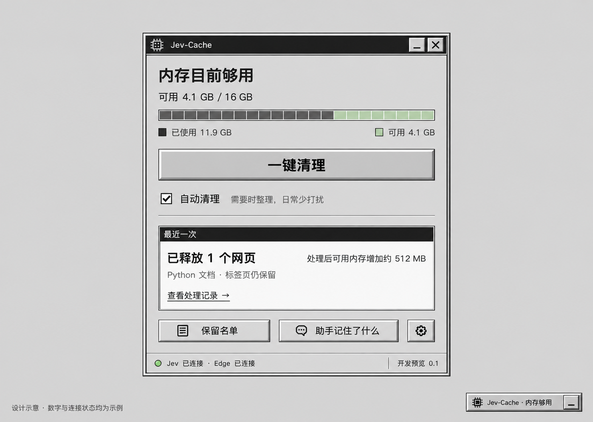
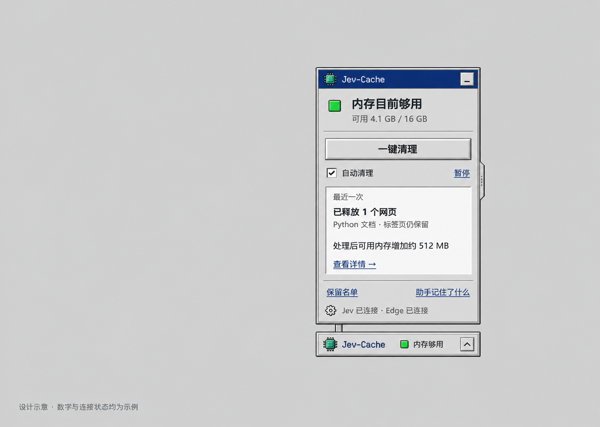
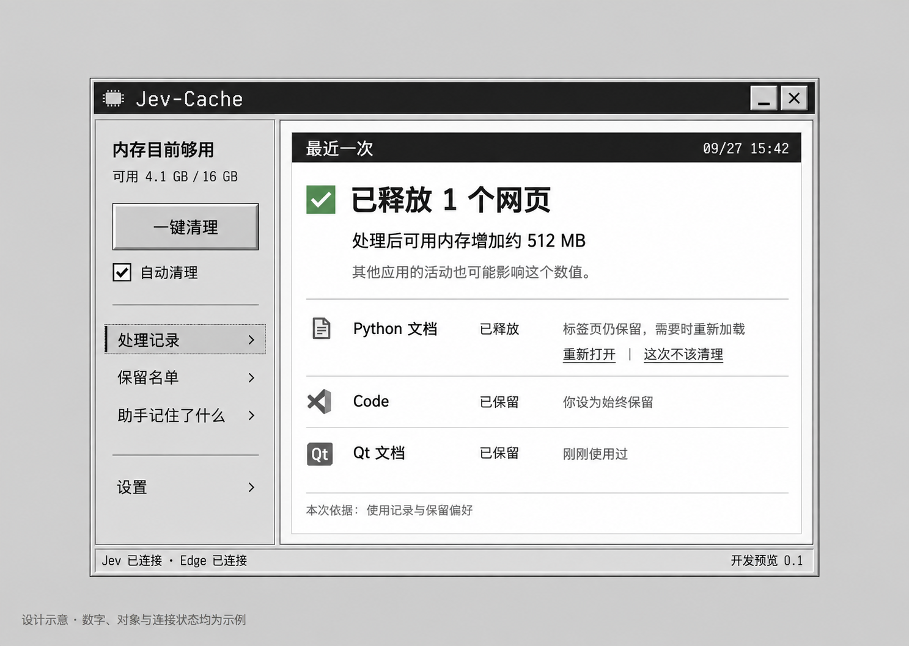

# Jev-Cache UI/UX 设计提案

日期：2026-09-27 · 基于 PRD v0.6 与当前 Python / PySide6 开发预览

状态：设计方向已进入第一轮实装，进度与验证见 [复古界面实装记录](UI-IMPLEMENTATION.md)。三张概念稿中的数字、对象、时间和连接状态均为示例。

## 1. 建议方向

**把 Jev-Cache 做成一件住在桌面角落的小工具：看一眼知道状态，点一下完成清理，展开能看懂取舍。**

建议采用第一张的灰黑视觉语言、第二张的紧凑日常形态，将第三张的清理回执用作详情页。默认体验围绕悬浮窗展开，完整工具面板按需打开。

核心动作统一命名为 **“一键清理”**，与 PRD 一致。用户无需理解进程、线程、LRU、LFU、置信度或模型预算。Jev 通过具体对象的保留／释放判断体现价值；习惯记忆通过可核对、可纠正的依据体现价值。

### 视觉参考

本次实际查看了 [TypeSafe 官网](https://typesafe.ai/)：灰白背景、黑色窄标题栏、矩形细边框、小型工具窗口、克制的等宽标签与大面积留白。采用这些视觉特征，同时借用 Windows 98 按钮的凸起／按下反馈。

中文正文保持现代可读性，像素感主要放在小图标、英文标题和边框。避免 CRT 扫描线、闪烁文字、启动音、满屏假操作系统和大量装饰弹窗。

### 三张独立概念稿

| 方向 | 核心体验 | 优势 | 实装前需调整 |
| --- | --- | --- | --- |
| 1 · 桌面工具箱 | 状态、主按钮、自动开关、最近结果按纵向阅读 | 最接近 TypeSafe，功能层级完整，适合成为视觉基础 | 收紧窗口尺寸；减少底部按钮重量；内存条严格按数值绘制 |
| 2 · 口袋助手 | 小型浮条向上展开一个短面板 | 最符合常驻工具的体量，清理入口直接 | 使用统一灰黑标题栏；将相邻的自动开关／暂停语义合并；缩小绿色状态方块 |
| 3 · 清理回执 | 最近结果与具体对象／依据并排阅读 | 解释 Jev 的取舍，纠正入口清楚 | 放入二级详情；结果状态下弱化再次清理；长原因换行，避免成为拥挤表格 |

这些是由内置 ImageGen 分别生成的视觉探索；工程规格以下文为准。提示词见 [生成记录](design/prompts.json)。

## 2. 三层界面

尺寸为初步逻辑像素目标，随字体和 Windows 缩放调整，不作为固定物理像素限制。

| 层级 | 建议尺寸 | 显示什么 | 用户能做什么 |
| --- | --- | --- | --- |
| 悬浮窗 | 约 264 × 76 | Jev-Cache、小状态、自动是否启用 | 一键清理、展开；标题区拖动 |
| 日常展开面板 | 约 424 × 500 | 当前状态、主按钮、自动开关、最近结果、详情入口 | 完成日常操作；查看本次处理；进入保留名单、记忆、设置 |
| 详情窗口 | 约 780 × 580，可缩放 | 本次／历史记录、应用与网页、保留名单、记忆与设置 | 查对象、纠正、重开、配置连接与数据选项 |

悬浮窗与展开面板是一套控制器的两种显示状态。展开后只突出一个清理按钮，隐藏浮条上的重复主按钮；同一时刻所有入口共享运行状态，连续点击不新增清理任务。

悬浮窗靠屏幕边缘收起、点击恢复，拖动区域与按钮分开。全屏应用前默认隐藏；拖到不同显示器、改变缩放或拔掉显示器后，窗口回到有效工作区。点击外部收起展开面板，不取消正在进行的任务；展开设置或输入文本时不因内部焦点变化误收起。

详情窗口的关闭按钮表示收起到托盘。首次收起用一次轻量提示解释；真正退出位于托盘菜单。悬浮窗的关闭控件若存在，只隐藏悬浮窗，并提供可发现的托盘恢复入口。

## 3. 日常主流程

### 手动

悬浮窗“一键清理” → 正在判断 → 正在清理 → 已完成的动作 → 有效内存观察结果。

首次设置完成后，一次点击直接处理符合资格的对象。流程不插入必填的任务描述、候选勾选页或普遍性的二次确认。信息不足的对象保留，在详情解释。

“这会儿你主要在做什么”收进可选的 **“补充这次需求”**；展开后允许写一句话，例如“这些资料接下来还会用”。用户不填写也能工作，应用不改成聊天界面。

### 自动

主面板使用一个“自动清理”复选框。首次开启在同一面板说明当前支持范围、需要时才处理、如何关闭，完成必要的设置后开始。连接未准备好时显示明确的“连接 Jev／连接 Edge”入口，不能只有无法点击的开关或悬停提示。

自动执行正常结果静默进入记录，悬浮窗短暂更新；全屏时不抢焦点、不弹普通成功通知。需要用户处理的连接故障在下次展开显示。关闭自动清理后手动入口仍可使用。

当前 `pause` 命令会暂停整个清理流程，不能直接标成“仅暂停自动”。首轮 UI 可以通过现有 `settings.auto` 开关控制自动模式；进行中的“停止后续清理”需绑定已有取消／失效机制并明确已完成动作不会回滚。

### 状态和文案

| 状态 | 主文案 | 行为与显示 |
| --- | --- | --- |
| 启动／样本不足 | 正在了解这台电脑 | 显示已取得的内存读数，不预先宣布内存紧张或预计收益 |
| 内存充裕 | 内存目前够用 | 一键清理仍可用；不制造红色警告或催促点击 |
| 持续内存紧张 | 内存有点紧张 | 已开启自动时说明正在观察或判断；条件必须来自程序实际信号 |
| Jev 判断中 | 正在判断哪些暂时用不上 | 不确定进度动画；按钮不可重复触发；保留停止后续处理入口 |
| 执行中 | 正在释放网页／请求应用正常退出 | 来自当前真实动作，不能提前显示完成或进度百分比 |
| 动作完成、测量中 | 已释放 1 个网页 | 次行“正在观察内存变化”，页面可操作，不等数值才反馈结果 |
| 有有效测量 | 处理后可用内存增加约 512 MB | 条件说明与数字同一视觉层级；同时保留动作回执 |
| 数值下降 | 处理后可用内存减少约 128 MB | 如实呈现，无成功绿勾包装数值；说明其他活动也会影响观测 |
| 没有合格对象 | 这次没有适合清理的对象 | 解释“当前需要的内容已保留”，仅在记录支持时列出具体原因 |
| 测量无效 | 已完成处理，本次无法确定内存变化 | 动作回执仍可见，不用估算填数字 |
| Jev 不可用 | Jev 暂时未连接 | 展示可用的本地观察、保留设置与单独关闭入口；不冒充智能清理成功 |
| 目标重新活动／状态变化 | 这个内容刚刚被使用，本次保留 | 跳过动作，正常结束，无需用户处理“技术错误” |

“够用／紧张”只描述内存条件，不承诺整机不卡。当前自动触发实现仍是固定阈值与持续时长，尚不能据此宣称识别所有性能瓶颈。

## 4. 让 Jev 的价值可理解

### 结果页分清三种信息

1. **做了什么**：来自执行回执，例如“已释放 Python 文档，标签页仍保留”。
2. **为什么这样选择**：来自当前事实、用户偏好及本轮结构化判断，例如“刚刚使用过”“你设为始终保留”“Jev 本次判断可稍后再用”。
3. **测到了什么**：来自有效测量窗口，例如“处理后可用内存增加约 512 MB”。

保留规则命中的对象标明“你要求保留／正在使用”，不归功于 Jev。模型判断可标明“Jev 本次判断”，不能换成确定的“你已经不需要”。无法把判断关联到证据时，只报告动作和状态，不生成事后理由。

结果页默认突出一个主事实。动作刚结束时突出动作回执；有效测量补齐后展示完整观测句，避免只放大 `+512 MB`。不显示“AI 安全分数”、累计释放 GB、推测帧率或节省时间。

### 对象详情

每行以熟悉的应用／网页名称开头，其次是处理状态，再是一句话原因。当前占用放在展开信息中；网页未取得可靠独立占用时显示“暂无单独数据”，不编造可释放 MB。

可用操作按真实能力显示：

- **始终保留**：用户明确偏好，立即影响尚未执行的判断；保留名单可撤销。
- **重新打开**：仅在原对象可定位且支持时出现；网页需要重新加载，不称为“完整撤销”。
- **这次不该清理**：记为本次反馈并影响后续判断，不自动扩大成永久保留全部同类网页。
- **正常关闭**：只在已支持的应用上出现，保留应用自己的保存提示；没有真实退出回执时不能报完成。

“重新打开”和“这次不该清理”必须分开：用户可能只是后来又需要该网页，并不认为上一轮清理错误。

### 助手记住了什么

用普通语言呈现“你要求保留”“这次纠正”“观察到的习惯”，来源和适用范围可展开。示例：“上次清理后，你很快重新打开了这组资料，本轮优先保留。”只有本轮实际读取并采用相应记录时才能显示。

当前版本已提供使用摘要、保留项与清除操作。第一轮重设计先把这些内容表达清楚；“习惯句子编辑／逐条忘记／证据次数与有效期”需要相应数据和命令补齐后开放。

“记住使用习惯”独立于自动开关。关闭后不再使用行为习惯，明确的保留项继续生效。当前清除命令同时删除学习与处理记录，按钮必须说明真实范围；逐条删除尚不可用时不画成可操作控件。

## 5. 首次使用与故障体验

首屏先展示实际可用功能和当前连接状态。开发预览的配置集中在设置页：Jev 密钥、最小摘要上传许可、可选网页标题、Edge 接入、本地习惯记录。不能把密钥已填写等同于“连接正常”；连接检测成功与真实清理成功分别显示。

完成一次固定文本连接测试，也不能让首页显示已优化电脑。自动模式必须同时满足真实连接、上传授权、支持的对象与执行条件。

浏览器接入作为独立步骤，显示“尚未连接／已连接／暂时断开”。目前安装流程依赖开发者扩展加载和本地桥接准备，需要提供步骤及完成检测；本次设计不把它伪装为已经实现的一键商店安装。

当前自动网页范围仍限定 Python / Qt 只读文档。面板的“支持范围”要能看见这项限制；普通桌面应用单独正常关闭与通用自动应用清理的资格不能混同。后续适配扩展后再扩大文案。

常规错误在原位置说明原因与下一步。仅删除本地记录等确有后果的操作使用清楚的确认框；不让正常清理每次都走多重确认。

## 6. 视觉与交互规格

| 元素 | 建议 |
| --- | --- |
| 主面板底色 | `#D6D6D6`，允许白色凹槽区域 `#FAFAF8` |
| 标题栏／主文本 | `#202020`；标题栏白字；辅助文字 `#555555` |
| 高光与阴影 | 白色上／左边，`#777777` 下／右边，外侧 `#202020` 细线 |
| 功能色 | 成功 `#326747`、待处理 `#895509`、故障 `#A63232`；配合图标和文字 |
| 焦点色 | `#1D45A1`，可见键盘焦点；不单靠像素虚线区分状态 |
| 字体 | 中文 Microsoft YaHei UI；英文 Segoe UI；少量英文标题／数字可用等宽字体 |
| 字号 | 正文 14–16，辅助信息不小于 12，状态标题 20–24；按 Qt 逻辑尺寸适配 |
| 间距 | 4 / 8 / 12 / 16 / 24；日常面板内边距约 16 |
| 按钮 | 主按钮高度 40–44；矩形双层边框；按下时边框反转、内容位移 1px |
| 图标 | 16 / 20 / 24 像素基准，统一阶梯边缘；实现使用可维护的图标资产，避免整块图片按钮 |
| 动效 | 展开／收起约 120ms，按下即时反馈；减少动态效果时直接切换；执行不确定进度不用假百分比 |
| 内存条 | 若保留，清楚标注已用／可用，按真实比值画；属于状态显示，不是清理进度 |

保留 Win98 的触觉感，按钮、复选框、链接仍遵循现代可用性。Tab 顺序稳定，主操作有键盘入口；图标按钮有可读名称；Esc 收起面板，不默认停止任务。100%／125%／150%／200% 缩放下文字不截断，小屏面板允许滚动。

## 7. 与现有代码的对应

本提案以工作区当前代码为准。PRD 末尾及旧验证文件保留了此前阶段的状态，不能单凭一句“尚未实现”判断当前所有能力。

| 能力 | 当前基础 | 本轮设计落地需要 |
| --- | --- | --- |
| 悬浮窗、托盘、全屏隐藏 | `ui.py` 的 `FloatingWindow`、托盘与现有定时更新 | 新主题、精简布局；靠边吸附和多屏恢复需核查／补齐 |
| 主操作与自动开关 | `Runtime.submit('optimize')`、`settings.auto`、`busy`、`paused` | 重用同一任务队列；统一入口状态，明确暂停作用范围 |
| 状态与测量 | `status`、`sample`、`last_result`、`history` | 增加稳定阶段枚举与本轮结果模型，避免 UI 解析自然语言判断状态 |
| 保留与对象列表 | `items`、`kept`、`keep_names`、保留／关闭命令 | 熟悉对象优先，技术详情折叠；能力不支持时说明原因 |
| 处理记录与重开／反馈 | 已有回执、`reopen`、`correct` 与冷却记录 | 按轮聚合；将完成、跳过、未完成区分展示 |
| Jev 的判断原因 | 后台保存结构化判断／策略记录，首页未充分呈现 | 增加候选 ID、理由类别、事实引用与判断来源的界面字段 |
| 本轮实际使用的记忆 | 使用摘要、相关反馈进入决策；现有 UI 主要显示数量和保留项 | 记录本轮读取的记忆 ID／版本及实际引用；不能凭历史存在就称“本次依据” |
| 自然语言习惯管理 | 当前界面尚不具备完整逐条解释／编辑 | 作为下一步能力，完成可追踪的数据与删除语义后再开放 |
| Jev／Edge 连接状态 | 配置状态、固定文本连接检测、浏览器连接已有入口 | 分清未配置、检测中、可用、失败；配置存在不等于实时在线 |

建议增加一个只做展示转换的 ViewModel，向 Qt 提供 `phase`、`mode`、`current_run`、`connection_state`、`reason_records`。每轮记录携带动作回执和测量资格；原因记录区分本地保护、用户偏好、Jev 判断及确实引用的记忆。它不拥有执行权限，也不替模型推断依据。

继续采用 PySide6 Qt Widgets 即可完成这些设计：QSS 处理颜色／边框，布局管理器承担缩放，QPainter 只绘制必要的分段条与小图标，现有 Runtime 线程发送状态。需要自定义标题栏时采用系统移动能力并保留可访问名称；不为复古外观引入第二套 Web UI。

实现顺序建议：

1. **外观与日常入口**：设计 token、控件主题、悬浮窗、展开面板；保留现有 Runtime 行为。
2. **结果可理解**：明确运行阶段、按轮回执、有效数值、逐项原因和纠正入口。
3. **记忆可管理与接入**：补齐逐条来源、真实引用、删除／关闭语义，再改进配置流程。

## 8. 体验验收

用真实状态和可控样例验证以下任务；设计稿数字不参与性能验收。

- 新用户十秒内能指出“哪里清理”“自动是否开启”“最近做了什么”。
- 从悬浮窗点击一次能发起合格清理；不需先填写场景、勾选对象或重复点击。
- 模型请求较慢、断网、无候选、状态变化、执行失败时，用户都能看懂当前情况。
- 动作已完成但数值尚未可靠时，界面先显示回执；下降、未知和无变化不被隐藏。
- 用户能找到始终保留、重新打开和本次纠正，并理解三者不同。
- 用户关闭习惯记忆后仍能看见明确保留项；删除范围与实际行为一致。
- 全屏、拖动、多显示器、缩放和键盘导航不会意外触发清理或遮挡正在做的事。

设计阶段交付了本提案和三张概念稿。后续第一轮界面实装及验证见 [实装记录](UI-IMPLEMENTATION.md)；概念图不作为清理效果证据。

## 依据

- [PRD v0.6](PRD.md)：第 3 节两种模式、第 5 节判断与记忆、第 7 节收益展示、第 9 节安装与数据。
- [当前 UI](../src/jev_cache/ui.py)、[运行控制](../src/jev_cache/runtime.py)、[候选与策略](../src/jev_cache/core.py)、[Edge 适配](../extensions/edge/src/background.ts)。
- [MVP 技术方案](MVP-TECH-PLAN.md)、[已有验证记录](../VALIDATION.md)：用来区分接口／测试证据与真实效果。
- [TypeSafe 官网](https://typesafe.ai/)：2026-09-27 实际浏览截图作为视觉参考；本地参考截图和原界面截图保留在被 Git 忽略的 `artifacts/design/`、`artifacts/packaged-main.png`。
